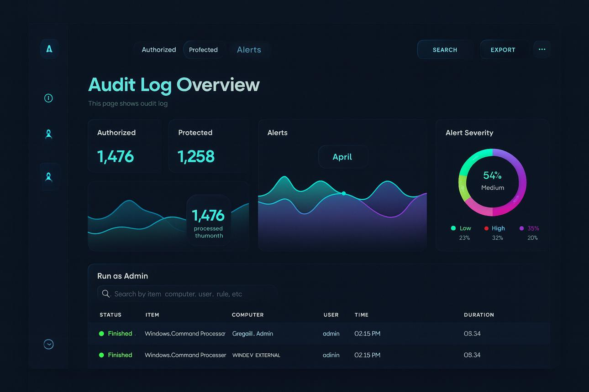
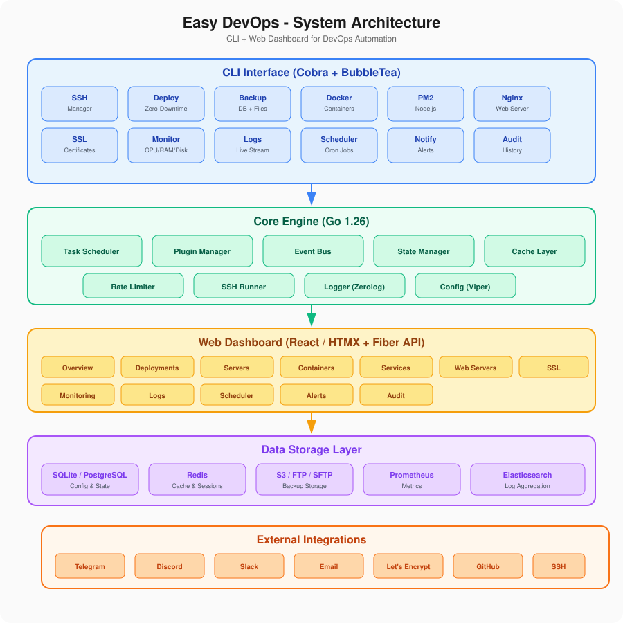

# Easy DevOps 🚀
> **One CLI + Web Dashboard to automate a DevOps engineer's daily work**
 
## ✨ What it can do

### Complete Feature List


| # | Feature | Purpose | CLI | Dashboard | API |
|---|---------|---------|-----|-----------|-----|
| 1 | **Go CLI (easydev)** | Command-line interface for all operations | ✅ | - | - |
| 2 | **Web Dashboard** | Central management interface for all features | - | ✅ | - |
| 3 | **REST API** | Programmatic access to all features | - | - | ✅ |
| 4 | **Multi-server SSH** | Run commands on multiple servers simultaneously | ✅ | ✅ | ✅ |
| 5 | **Deployments** | Deploy applications with one command | ✅ | ✅ | ✅ |
| 6 | **Backups** | Automated database and file backups | ✅ | ✅ | ✅ |
| 7 | **Monitoring** | Track CPU, RAM, Disk usage in real-time | ✅ | ✅ | ✅ |
| 8 | **Docker Management** | Manage containers, images, and networks | ✅ | ✅ | ✅ |
| 9 | **Nginx Automation** | Safety Check - Reload, test, and manage Nginx | ✅ | ✅ | ✅ |
| 10 | **WordPress Automation** | WordPress maintenance and optimization | ✅ | ✅ | ✅ |
| 11 | **Telegram Alerts** | Real-time alerts via Telegram bot | ✅ | ✅ | ✅ |
| 12 | **WhatsApp Alerts** | Real-time alerts via WhatsApp Business API | ✅ | ✅ | ✅ |
| 13 | **Scheduler** | Manage cron jobs and scheduled tasks | ✅ | ✅ | ✅ |
| 14 | **Audit Logs** | Complete command history and audit trail | ✅ | ✅ | ✅ |
| 15 | **Enterprise Backup** | Full backup, disaster recovery, and verification | ✅ | ✅ | ✅ |
| 16 | **Storage Providers** | Multi-cloud backup storage (S3, GCS, Azure, FTP) | ✅ | ✅ | ✅ |
| 17 | **Incremental Backup** | Efficient incremental/differential backup engine | ✅ | ✅ | ✅ |
| 18 | **Retention Policy** | Automated backup retention and cleanup | ✅ | ✅ | ✅ |
| 19 | **Backup Scheduler** | Visual cron-based backup scheduling | ✅ | ✅ | ✅ |
| 20 | **Backup Verification** | Automated integrity checks and validation | ✅ | ✅ | ✅ |
| 21 | **Restore Engine** | Point-in-time and full system restore | ✅ | ✅ | ✅ |
| 22 | **Server Recovery** | One-command bare metal server recovery | ✅ | ✅ | ✅ |
| 23 | **Enterprise Monitoring** | Advanced metrics, APM, and intelligent alerting | ✅ | ✅ | ✅ |
| 24 | **Multi-Server Dashboard** | Centralized view of all servers and services | ✅ | ✅ | ✅ |
| 25 | **Self-Healing Preparation** | Health checks, auto-restart, and recovery rules | ✅ | ✅ | ✅ |
| 26 | **AI DevOps Assistant** | AI-powered self-healing automation engine | ✅ | ✅ | ✅ |
| 27 | **Disk Protection** | Disk health monitoring, RAID management, and protection | ✅ | ✅ | ✅ |
| 28 | **Disk Cleanup** | Automated disk cleanup and space optimization | ✅ | ✅ | ✅ |
| 29 | **Enterprise Web Dashboard** | Go Fiber + React + WebSocket real-time dashboard | ✅ | ✅ | ✅ |
| 30 | **Audit Logging** | Comprehensive audit trail with search and export | ✅ | ✅ | ✅ |
| 31 | **Plugin Marketplace** | Extend functionality with community plugins | ✅ | ✅ | ✅ |
| 32 | **Offline Enterprise Edition** | Air-gapped deployment without internet | ✅ | ✅ | ✅ |
| 33 | **Agent Auto-Update** | Automatic agent updates across all servers | ✅ | ✅ | ✅ |
| 34 | **High Availability** | HA control plane with load balancing | ✅ | ✅ | ✅ |
| 35 | **Enterprise Security** | RBAC, encryption, compliance, and security hardening | ✅ | ✅ | ✅ |
| 36 | **Control Plane** | CI/CD pipeline orchestration with webhook integration | ✅ | ✅ | ✅ |


### Feature Details

#### 1. 🖥️ Go CLI (easydev)
- Single binary executable
- Cross-platform support (Linux, macOS, Windows)
- Auto-completion for bash/zsh/fish
- Colorized output
- Progress bars and spinners
- Interactive prompts
- Config file support (YAML/TOML)
- Environment variable overrides

#### 2. 🖥️ Web Dashboard
- Central management interface for all features
- Real-time system overview
- Server management with SSH access
- Docker container management UI
- Service health monitoring
- Nginx configuration editor
- SSL certificate management
- Log viewer with search and filters
- Cron job scheduler interface
- Notification settings and testing
- Audit log viewer
- User management and RBAC
- Dark/Light theme toggle
- Responsive design (mobile/tablet/desktop)
- WebSocket for live updates
- API documentation (Swagger/OpenAPI)

#### 3. 🔌 REST API
- RESTful endpoints for all features
- JWT authentication
- API key authentication
- Rate limiting
- Request validation
- OpenAPI/Swagger documentation
- CORS support
- Pagination and filtering
- Webhook support
- GraphQL endpoint (optional)

#### 4. 🔐 Multi-server SSH
- Run commands on multiple servers in parallel
- Batch script execution
- SSH key management
- Session recording
- Connection pooling
- Parallel execution with concurrency control
- Custom SSH config support
- Jump host/bastion support
- Command timeout handling
- Output aggregation

#### 5. 🚀 Deployments
- Zero-downtime deployments
- Rollback capability
- Multi-environment support (dev, staging, production)
- Deployment history tracking
- Health checks after deploy
- Pre/post-deploy hooks
- Git integration
- Docker image deployment
- Blue/green deployments
- Canary releases

#### 6. 💾 Backups
- Automated database backups (MySQL, PostgreSQL, MongoDB, MariaDB)
- File system backups
- Scheduled backup jobs
- Remote storage (S3, FTP, SFTP, Google Drive)
- Backup compression (gzip)
- Backup encryption
- Incremental backups
- Backup verification
- Restore with point-in-time recovery
- Backup retention policies

#### 7. 📊 Monitoring
- Real-time CPU usage
- Memory/RAM monitoring
- Disk space tracking
- Network I/O stats
- Custom alerts
- Historical data with time-range selector
- Export metrics (JSON, CSV)
- Custom dashboards
- Alert thresholds with visual indicators
- Integration with Prometheus/Grafana

#### 8. 🐳 Docker Management
- Container management (start, stop, restart)
- Image management
- Container logs
- Resource monitoring
- Docker Compose support
- Multi-server Docker management
- Container health checks
- Volume management
- Network management
- Image cleanup and pruning

#### 9. 🌐 Nginx Automation
- Config reload without downtime
- Syntax validation
- Virtual host management (list, enable, disable)
- Service status and control (start, stop, restart, enable, disable)
- Log management (access logs, error logs, log rotation)
- SSL certificate checking
- Permission fixing
- Proxy cache purging
- Rate limiting configuration
- Reverse proxy management

#### 10. 🌐 WordPress Automation
- Cache clearing (WP Object Cache + Redis + PHP-FPM)
- Database optimization (defragment tables)
- Transient cleanup
- Plugin and theme updates
- Core updates
- Database export/import
- Security scanning
- Performance analysis
- Multisite support
- Staging environment management

#### 11. 📱 Telegram Alerts
- Real-time deployment notifications
- Server health alerts (CPU, RAM, Disk)
- SSL certificate expiry warnings
- Docker container status changes
- Custom alert messages
- Multi-group support
- Alert scheduling (quiet hours)
- Message formatting (HTML/Markdown)
- Alert history and logging
- Webhook integration

#### 12. 💬 WhatsApp Alerts
- WhatsApp Business API integration
- Real-time deployment notifications
- Server health alerts
- SSL certificate expiry warnings
- Custom alert templates
- Multi-contact support
- Message queuing for reliability
- Delivery confirmation tracking
- Rate limiting compliance
- Template message support

#### 13. ⏰ Scheduler
- Cron job management
- Visual scheduling
- Job history
- Failure alerts
- Job dependencies
- Job chaining
- Resource limits
- Job labels and tags
- Import/export jobs
- Calendar view

#### 14. 📋 Audit Logs
- Command execution history
- User activity logging
- Change tracking
- Compliance reporting
- Log retention policies
- Search and filtering
- Export logs
- Real-time streaming
- Correlation IDs
- Tamper-proof logging

#### 15. 🛡️ Enterprise Backup & Disaster Recovery
- Full environment backup (database + files + configs)
- Database-only backup with compression
- File system backup with incremental support
- Point-in-time restore
- Backup verification and integrity checks
- Multi-environment support (dev, staging, production)
- Automated backup scheduling
- Remote storage replication (S3, GCS, Azure Blob)
- Backup encryption (AES-256)
- Disaster recovery runbooks
- RPO/RTO monitoring
- Backup retention policies
- Cross-region replication
- Bare metal restore capability

##### Backup Manifest
- JSON manifest for every backup
- File checksums (SHA-256)
- Backup metadata (timestamp, environment, size, type)
- Restore instructions
- Dependency graph

##### Server Configuration Backup
- `/etc/nginx/` - Nginx configurations
- `/etc/php/` - PHP configurations
- `/etc/systemd/` - Systemd service files
- `/etc/fail2ban/` - Fail2ban jail configurations
- `/etc/redis/` - Redis configurations
- `/etc/postgresql/` - PostgreSQL configurations
- `/etc/mysql/` - MySQL/MariaDB configurations
- PM2 process configurations

##### Backup Protection
- SHA-256 file hashing
- Password-protected archives
- AES-256 encryption
- Checksum verification on restore
- Tamper detection
- Secure key management

#### 16. ☁️ Storage Providers
- **AWS S3** - S3, S3 Glacier, S3 Deep Archive
- **Google Cloud Storage** - Standard, Nearline, Coldline, Archive
- **Azure Blob Storage** - Hot, Cool, Archive tiers
- **DigitalOcean Spaces** - S3-compatible storage
- **Backblaze B2** - Cost-effective cloud storage
- **MinIO** - Self-hosted S3-compatible storage
- **FTP/SFTP** - Traditional file transfer
- **WebDAV** - Web distributed authoring
- **Local Storage** - NAS, USB, external drives
- **Restic/Rclone** - Multi-provider backend
- Bandwidth throttling and scheduling
- Multi-region replication
- Storage lifecycle policies
- Cost estimation and reporting

#### 17. 🔄 Incremental Backup Engine
- Block-level incremental backups
- File-level differential backups
- Changed block tracking (CBT)
- Binary diff algorithm (xdelta/bsdiff)
- Deduplication (source and target)
- Variable-length chunking
- Backup chain management
- Synthetic full backups
- Fast incremental verification
- Cross-platform deduplication
- Backup window optimization
- Bandwidth-efficient transfers
- Resumable backup operations
- Compression per chunk (zstd, lz4, gzip)

#### 18. 📋 Retention Policy
- **Simple Rules**: Keep last N backups
- **Time-based**: Keep daily/weekly/monthly/yearly
- **GFS Rotation**: Grandfather-Father-Son scheme
- **Custom Rules**: Tag-based retention
- **Minimum Retention**: Always keep N days
- **Maximum Retention**: Auto-cleanup old backups
- **Size-based**: Keep until total size limit
- **Event-based**: Retain after deploy/release
- **Compliance Rules**: GDPR, HIPAA, SOX retention
- **Cross-region**: Different rules per region
- Automated cleanup scheduling
- Retention policy templates
- Policy conflict resolution
- Audit trail for deletions
- Restore point objectives (RPO)

#### 19. 🕐 Backup Scheduler
- Visual calendar interface
- Cron expression builder
- Multiple schedules per backup
- Dependency-based scheduling
- Resource-aware scheduling
- Concurrent job limits
- Priority queuing
- Skip if unchanged
- Event-triggered backups
- Webhook integration
- Schedule templates
- Import/export schedules
- Holiday exclusions
- Maintenance window support
- Schedule conflict detection

#### 20. ✅ Backup Verification
- **Automated Checks**: Daily/weekly verification
- **Checksum Validation**: SHA-256 integrity
- **Restore Test**: Automated restore to sandbox
- **Database Validation**: MySQL/PostgreSQL check
- **File Integrity**: Binary comparison
- **Application Test**: Post-restore health check
- **Size Validation**: Expected vs actual
- **Age Verification**: Freshness check
- **Cross-region**: Verify replicas
- **Encryption**: Key and cipher validation
- **Compliance**: Regulatory compliance check
- Verification reports and history
- Alert on verification failure
- Integration with monitoring
- Custom verification scripts

#### 21. 🔧 Restore Engine
- **Full Restore**: Complete system restore
- **Partial Restore**: Selective file/database restore
- **Point-in-time**: Restore to any timestamp
- **Cross-system**: Restore to different server
- **Granular**: Individual tables/files
- **Parallel Restore**: Multi-threaded restore
- **Restore Verification**: Post-restore checks
- **Rollback**: Undo partial restores
- **Preview**: Dry-run restore
- **Progress Tracking**: Real-time restore status
- **Resume**: Interrupted restore resume
- **Conflict Resolution**: Handle file conflicts
- **Dependency Order**: Respect service dependencies
- **Pre/Post Scripts**: Custom restore hooks
- **Notifications**: Alert on restore completion

#### 22. 🚨 One-Command Server Recovery
```bash
# Full server recovery from backup
easydev recover server production

# Recover to bare metal
easydev recover bare-metal production --target new-server

# Recover from specific backup
easydev recover server production --backup-id 789

# Recover to point in time
easydev recover server production --to "2026-09-05 14:30:00"

# Partial recovery (configs only)
easydev recover configs production

# Database-only recovery
easydev recover database production

# File-only recovery
easydev recover files production

# Verify recovery readiness
easydev recover preflight production

# Generate recovery runbook
easydev recover runbook production

# Test recovery (sandbox)
easydev recover test production --sandbox

# Multi-server parallel recovery
easydev recover cluster production --servers web1,web2,web3

# Post-recovery validation
easydev recover validate production

# Recovery with notifications
easydev recover server production --notify telegram,whatsapp
```

#### 23. 📊 Enterprise Monitoring & Alerting
- **Real-time Metrics**: CPU, Memory, Disk, Network, I/O
- **Application Performance**: Response time, throughput, errors
- **Custom Metrics**: Business KPIs, custom collectors
- **Log Aggregation**: Centralized logging with search
- **Distributed Tracing**: Request flow across services
- **Service Discovery**: Auto-detect services
- **Health Checks**: HTTP, TCP, DNS, custom probes
- **SLA Monitoring**: Uptime tracking and reporting
- **Capacity Planning**: Predictive analytics
- **Cost Monitoring**: Cloud spend tracking

**Alerting Features:**
- Multi-channel alerts (Email, SMS, Push, Webhook)
- Escalation policies
- Alert correlation and deduplication
- Maintenance windows
- On-call scheduling (PagerDuty, OpsGenie)
- Runbook automation
- Incident management
- Post-mortem tracking
- SLA breach notifications
- Custom alert rules (Prometheus/Alertmanager)

**Dashboard Features:**
- Real-time dashboards
- Custom widgets
- drill-down capabilities
- Time range selector
- Export to PDF/CSV
- Embeddable widgets
- Mobile app support
- White-label option

#### 24. 🖥️ Multi-Server Dashboard
- **Server Grid View**: All servers in one view
- **Health Status**: Green/Yellow/Red indicators
- **Resource Overview**: CPU, RAM, Disk per server
- **Service Map**: Visual service dependencies
- **Geographic View**: Server locations on map
- **Group Management**: Organize by environment/role
- **Bulk Operations**: Run commands on multiple servers
- **Server Details**: Drill-down to individual server
- **Search & Filter**: Find servers quickly
- **Custom Views**: Save favorite server groups
- **Real-time Updates**: WebSocket live data
- **Mobile Responsive**: Access from any device

**Dashboard Panels:**
```
┌─────────────────────────────────────────────────────────────────────────┐
│  🖥️ Multi-Server Dashboard                     [Add Server] [Groups]   │
├─────────────────────────────────────────────────────────────────────────┤
│  Overview: 12 servers │ 10 healthy │ 1 warning │ 1 critical            │
├─────────────────────────────────────────────────────────────────────────┤
│  Production (5 servers)                                                 │
│  ┌─────────┬─────────┬─────────┬─────────┬─────────┐                   │
│  │ web1    │ web2    │ web3    │ api1    │ db1     │                   │
│  │ 🟢 45%  │ 🟢 32%  │ 🟡 78%  │ 🟢 28%  │ 🟢 15%  │                   │
│  │ CPU     │ CPU     │ CPU     │ CPU     │ CPU     │                   │
│  │ 🟢 62%  │ 🟢 55%  │ 🟢 71%  │ 🟢 48%  │ 🟢 38%  │                   │
│  │ RAM     │ RAM     │ RAM     │ RAM     │ RAM     │                   │
│  │ ✅ 45GB │ ✅ 32GB │ ⚠️ 78GB │ ✅ 28GB │ ✅ 15GB │                   │
│  │ Free    │ Free    │ Free    │ Free    │ Free    │                   │
│  └─────────┴─────────┴─────────┴─────────┴─────────┘                   │
├─────────────────────────────────────────────────────────────────────────┤
│  Staging (3 servers)           │  Development (4 servers)              │
│  ┌─────────┬─────────┬────┐   │  ┌─────────┬─────────┬────┬────┐     │
│  │ stg-web │ stg-api │stg │   │  │ dev-web │ dev-api │dev │dev │     │
│  │ 🟢 22%  │ 🟢 18%  │🟢  │   │  │ 🟢 15%  │ 🟢 12%  │🟢  │🟢  │     │
│  └─────────┴─────────┴────┘   │  └─────────┴─────────┴────┴────┘     │
└─────────────────────────────────────────────────────────────────────────┘
```

#### 25. 🔧 Self-Healing (Preparation)
- **Health Checks**: HTTP, TCP, DNS, custom probes
- **Auto-Restart**: Restart failed services automatically
- **Service Watchdog**: Monitor and restart unresponsive services
- **Resource Limits**: CPU/RAM/Disk thresholds
- **Connection Pool**: Detect and fix connection leaks
- **Log Monitoring**: Detect error patterns
- **Port Scanning**: Verify service availability
- **Process Monitoring**: Detect zombie/orphan processes
- **Dependency Checks**: Verify upstream/downstream services
- **Custom Scripts**: Run remediation scripts

**Health Check Rules:**
```yaml
health_checks:
  - name: "HTTP Health Check"
    type: http
    target: "http://localhost:8080/health"
    interval: 10s
    timeout: 5s
    retries: 3
    on_failure: restart

  - name: "TCP Port Check"
    type: tcp
    target: "localhost:5432"
    interval: 30s
    on_failure: alert

  - name: "Disk Space"
    type: disk
    threshold: 90%
    on_failure: cleanup

  - name: "Memory Usage"
    type: memory
    threshold: 85%
    on_failure: alert
```

**Auto-Recovery Actions:**
- Restart service (systemctl, PM2, Docker)
- Kill and respawn process
- Clear cache/memory
- Rotate logs
- Reconnect database
- Failover to backup
- Scale up resources
- Execute custom script

#### 26. 🤖 AI DevOps Assistant (Self-Healing Automation Engine)
- **Anomaly Detection**: ML-based pattern recognition
- **Predictive Analytics**: Forecast issues before they occur
- **Root Cause Analysis**: AI-powered incident analysis
- **Auto-Remediation**: Intelligent fix recommendations
- **Learning Engine**: Learn from past incidents
- **Natural Language**: Chat with AI assistant
- **Runbook Automation**: Auto-execute runbooks
- **Pattern Matching**: Correlate multiple alerts
- **Capacity Forecasting**: Predict resource needs
- **Cost Optimization**: AI-driven recommendations

**AI Features:**
```
┌─────────────────────────────────────────────────────────────────────────┐
│  🤖 AI DevOps Assistant                                  [Ask AI]      │
├─────────────────────────────────────────────────────────────────────────┤
│  💡 Insights                                                            │
│  ─────────────────────────────────────────────────────────────────────  │
│  🔮 Prediction: web3 memory will reach 90% in ~4 hours                 │
│  📊 Trend: API response time increasing 15% over last 24h              │
│  💰 Cost: Right-sizing api1 could save $45/month                       │
│  🔒 Security: 2 containers running with outdated images                │
├─────────────────────────────────────────────────────────────────────────┤
│  🔧 Auto-Healing Active                                                 │
│  ─────────────────────────────────────────────────────────────────────  │
│  ✅ Restarted nginx on web2 (was unresponsive)                         │
│  ✅ Cleared Redis cache on cache1 (memory > 90%)                       │
│  ✅ Scaled worker from 2→3 instances (high CPU)                        │
│  ⏳ Monitoring api1 for further anomalies                              │
├─────────────────────────────────────────────────────────────────────────┤
│  📚 Learning                                                            │
│  ─────────────────────────────────────────────────────────────────────  │
│  Pattern learned: High memory → Clear cache → Restart if persists      │
│  Accuracy: 94% | False positives: 3% | Avg response: 45s               │
├─────────────────────────────────────────────────────────────────────────┤
│  💬 Ask AI: [What caused the outage yesterday?           ] [Send]      │
└─────────────────────────────────────────────────────────────────────────┘
```

**AI Automation Rules:**
- **Anomaly Response**: Auto-scale on traffic spikes
- **Memory Leak**: Restart service on memory threshold
- **Connection Reset**: Reconnect on connection pool exhaustion
- **Disk Cleanup**: Auto-rotate logs on disk pressure
- **Failover**: Switch to backup on service failure
- **Rate Limit**: Throttle on abuse detection
- **SSL Renew**: Auto-renew before expiry
- **Backup Trigger**: Backup after significant changes

#### 27. 💾 Disk Protection
- **S.M.A.R.T. Monitoring**: Predict disk failures
- **RAID Management**: Monitor and manage RAID arrays
- **Disk Health Scanning**: Regular disk surface scans
- **Bad Block Detection**: Identify and mark bad sectors
- **Temperature Monitoring**: Track disk temperature
- **Wear Leveling**: SSD wear level monitoring
- **Predictive Failure**: AI-based failure prediction
- **Auto Backup**: Backup before disk replacement
- **Hot Swap Support**: Detect and manage hot-swappable disks
- **Encryption**: Full disk encryption (LUKS)
- **Mount Point Monitoring**: Monitor all mount points
- **Inode Monitoring**: Track inode usage
- **Disk Quotas**: Set and enforce disk quotas

**Disk Protection Features:**
- Real-time disk health status
- S.M.A.R.T. attribute tracking
- RAID rebuild monitoring
- Disk temperature alerts
- Predictive failure alerts (30, 14, 7 days)
- Automatic disk backup before failure
- Disk replacement workflow
- Multi-disk redundancy checks

#### 28. 🧹 Disk Cleanup
- **Log Cleanup**: Rotate and compress old logs
- **Cache Cleanup**: Clear application caches
- **Temp Files**: Remove temporary files
- **Package Cache**: Clean package manager cache
- **Docker Cleanup**: Remove unused images/containers
- **Journal Cleanup**: Clean systemd journal
- **Core Dumps**: Remove old core dumps
- **Old Backups**: Enforce retention policies
- **Duplicate Files**: Find and remove duplicates
- **Large Files**: Identify large files
- **Empty Directories**: Remove empty folders
- **Thumbnail Cache**: Clear thumbnail cache
- **Browser Cache**: Clear browser caches
- **Package Logs**: Clean package manager logs

**Disk Cleanup Features:**
```
┌─────────────────────────────────────────────────────────────────────────┐
│  🧹 Disk Cleanup Dashboard                               [Clean Now]    │
├─────────────────────────────────────────────────────────────────────────┤
│  Disk Usage: 450GB / 500GB (90%) ████████████████████████░░ ⚠️         │
├─────────────────────────────────────────────────────────────────────────┤
│  Cleanup Candidates:                       Recoverable Space:          │
│  ─────────────────────────────────────────────────────────────────────  │
│  📁 /var/log/                    12.5 GB  ████████████░░░░░░░░         │
│  🐳 Docker images                 8.3 GB  ████████░░░░░░░░░░░░         │
│  📦 Package cache                 3.2 GB  ███░░░░░░░░░░░░░░░░░         │
│  🗑️ Temp files                    1.8 GB  ██░░░░░░░░░░░░░░░░░░         │
│  📋 Systemd journal               2.1 GB  ██░░░░░░░░░░░░░░░░░░         │
│  💾 Old backups                   5.6 GB  ██████░░░░░░░░░░░░░░         │
│  ─────────────────────────────────────────────────────────────────────  │
│  Total recoverable:             33.5 GB                              │
├─────────────────────────────────────────────────────────────────────────┤
│  [📋 Preview] [🧹 Clean Logs] [🐳 Clean Docker] [📦 Clean Cache]       │
└─────────────────────────────────────────────────────────────────────────┘
```

#### 29. 🖥️ Enterprise Web Dashboard (Go Fiber + React + WebSocket)

**Technology Stack:**
| Component | Technology |
|-----------|------------|
| Backend API | Go 1.26 + Fiber v2 |
| Frontend | React 18 + TypeScript |
| State Management | Zustand / Redux Toolkit |
| UI Framework | Tailwind CSS + Headless UI |
| Real-time | WebSocket (gorilla/websocket) |
| Charts | Recharts / Chart.js |
| Authentication | JWT + OAuth2 |
| Database | SQLite / PostgreSQL |
| Cache | Redis |

**Architecture:**
```
┌─────────────────────────────────────────────────────────────────────────┐
│                         Go Fiber Backend                                │
│  ┌─────────────────────────────────────────────────────────────────┐   │
│  │  REST API Endpoints    │    WebSocket Hub    │    Middleware      │   │
│  │  /api/v1/servers       │    /ws/metrics      │    JWT Auth       │   │
│  │  /api/v1/deployments   │    /ws/logs         │    Rate Limit     │   │
│  │  /api/v1/containers    │    /ws/alerts       │    CORS           │   │
│  │  /api/v1/monitoring    │    /ws/healing      │    Logging        │   │
│  └─────────────────────────────────────────────────────────────────┘   │
└─────────────────────────────────────────────────────────────────────────┘
                                    │
                                    ▼
┌─────────────────────────────────────────────────────────────────────────┐
│                        React Frontend                                   │
│  ┌─────────────────────────────────────────────────────────────────┐   │
│  │  Dashboard    │  Servers  │  Containers  │  Monitoring  │  Logs │   │
│  │  Deployments  │  Backups  │  Scheduler   │  Settings    │  AI   │   │
│  └─────────────────────────────────────────────────────────────────┘   │
└─────────────────────────────────────────────────────────────────────────┘
```

**Dashboard Features:**
- Real-time server metrics (WebSocket)
- Interactive charts and graphs
- Drag-and-drop widget layout
- Dark/Light theme toggle
- Mobile responsive design
- Command palette (Ctrl+K)
- Keyboard shortcuts
- Multi-language support (i18n)
- Export to PDF/CSV
- Print-friendly views

**WebSocket Channels:**
- `/ws/metrics` - Real-time CPU, RAM, Disk, Network
- `/ws/logs` - Live log streaming
- `/ws/alerts` - Instant alert notifications
- `/ws/healing` - Self-healing events
- `/ws/deployments` - Deployment progress
- `/ws/containers` - Docker container status

#### 30. 📋 Audit Logging
- **Command Logging**: Every CLI command executed
- **API Request Logging**: All API calls tracked
- **User Activity**: Login, logout, actions
- **Change Tracking**: Configuration changes
- **Security Events**: Auth failures, permission denials
- **Resource Access**: File, database, service access
- **Compliance Logging**: GDPR, HIPAA, SOC2, PCI-DSS
- **Export Formats**: JSON, CSV, Syslog, SIEM
- **Real-time Streaming**: Live audit log feed
- **Tamper Protection**: Cryptographic signatures
- **Retention Policies**: Configurable log retention
- **Search & Filter**: Advanced query capabilities

**Audit Log Screenshot:**


**Audit Dashboard:**
```
┌─────────────────────────────────────────────────────────────────────────┐
│  📋 Audit Logging Dashboard                            [Export] [Filter]│
├─────────────────────────────────────────────────────────────────────────┤
│  Total Events: 1,247,832    Today: 3,456    Critical: 12              │
├─────────────────────────────────────────────────────────────────────────┤
│  Time              User      Action           Resource      Status     │
│  ─────────────────────────────────────────────────────────────────────  │
│  2026-09-05 14:32  admin     deploy           myapp         ✅ Success │
│  2026-09-05 14:30  admin     ssh-exec         web1          ✅ Success │
│  2026-09-05 14:28  unknown   login-attempt    /api/auth     ❌ Failed  │
│  2026-09-05 14:25  admin     backup           production    ✅ Success │
│  2026-09-05 14:20  devops    config-change    nginx.conf    ⚠️ Warning │
├─────────────────────────────────────────────────────────────────────────┤
│  📊 Events by Type           │  📊 Events by User                      │
│  Commands:    45% ████████░░ │  admin:    52% ██████████               │
│  API Calls:   30% ██████░░░░ │  devops:   28% █████░░░░░               │
│  Auth:        15% ███░░░░░░░ │  ci-bot:   15% ███░░░░░░░               │
│  Security:    10% ██░░░░░░░░ │  unknown:   5% █░░░░░░░░░               │
└─────────────────────────────────────────────────────────────────────────┘
```

#### 31. 🧩 Plugin Marketplace
- **Official Plugins**: Core functionality extensions
- **Community Plugins**: Third-party contributions
- **Plugin Manager**: Install, update, remove plugins
- **Version Control**: Plugin version management
- **Dependency Resolution**: Auto-install dependencies
- **Security scanning**: Plugin vulnerability checks
- **Rating System**: Community ratings and reviews
- **Documentation**: Plugin docs and examples
- **License Management**: Open source and commercial
- **Analytics**: Plugin usage statistics

**Available Plugins:**
```
┌─────────────────────────────────────────────────────────────────────────┐
│  🧩 Plugin Marketplace                                  [Installed: 5]  │
├─────────────────────────────────────────────────────────────────────────┤
│  Featured Plugins                                                      │
│  ─────────────────────────────────────────────────────────────────────  │
│  📦 k8s-support     v2.1.0   Kubernetes management        ⭐ 4.8  [Install]│
│  📦 terraform-sync  v1.5.2   Terraform state sync         ⭐ 4.7  [Install]│
│  📦 vault-integ     v1.2.0   HashiCorp Vault integration  ⭐ 4.6  [Install]│
│  📦 grafana-embed   v3.0.1   Embedded Grafana dashboards  ⭐ 4.9  [Install]│
│  ─────────────────────────────────────────────────────────────────────  │
│  Categories: [Monitoring] [Security] [Cloud] [Database] [CI/CD]        │
└─────────────────────────────────────────────────────────────────────────┘
```

#### 32. 💿 Offline Enterprise Edition
- **Air-gapped Installation**: No internet required
- **Offline Bundle**: Complete package with all dependencies
- **Local Repository**: Internal plugin/dependency mirror
- **License Activation**: Offline license key validation
- **Update bundles**: Offline update packages
- **Custom branding**: White-label support
- **Priority support**: Dedicated enterprise support
- **SLA guarantees**: 99.9% uptime SLA
- **Custom features**: Feature development on request
- **Training**: On-site training sessions

**Offline Installation:**
```bash
# Download offline bundle (on internet-connected machine)
easydev offline bundle --output easydev-offline-v1.0.0.tar.gz

# Transfer to air-gapped server
scp easydev-offline-v1.0.0.tar.gz server:/tmp/

# Install on air-gapped server
easydev offline install --bundle /tmp/easydev-offline-v1.0.0.tar.gz

# Activate license offline
easydev offline license --key XXXX-XXXX-XXXX-XXXX

# Update from offline bundle
easydev offline update --bundle /tmp/easydev-update-v1.1.0.tar.gz
```

#### 33. 🔄 Agent Auto-Update
- **Automatic Detection**: Check for new versions
- **Rolling Updates**: Update agents one-by-one
- **Health Checks**: Verify after each update
- **Auto Rollback**: Rollback on failure
- **Scheduled Updates**: Update during maintenance windows
- **Version Pinning**: Lock to specific versions
- **Update Channels**: stable, beta, nightly
- **Notification**: Alert on update completion
- **Audit Trail**: Log all updates
- **Rollback History**: Keep previous versions

**Agent Update Flow:**
```
┌─────────────────────────────────────────────────────────────────────────┐
│  🔄 Agent Auto-Update                                        [Settings]│
├─────────────────────────────────────────────────────────────────────────┤
│  Current Version: v1.0.0    Latest: v1.1.0    Status: Update Available │
├─────────────────────────────────────────────────────────────────────────┤
│  Server      Current    Latest     Status        Last Updated           │
│  ─────────────────────────────────────────────────────────────────────  │
│  web1        v1.0.0     v1.1.0     ✅ Updated    2026-09-05 14:30      │
│  web2        v1.0.0     v1.1.0     🔄 Updating   -                     │
│  web3        v1.0.0     v1.1.0     ⏳ Queued     -                     │
│  db1         v1.0.0     v1.1.0     ⏳ Queued     -                     │
│  cache1      v1.0.0     v1.1.0     ⏳ Queued     -                     │
├─────────────────────────────────────────────────────────────────────────┤
│  Update Policy:                                                    [▼] │
│  • Rolling update with 1 server at a time                           │
│  • Health check before proceeding to next                           │
│  • Auto-rollback on failure                                         │
│  • Maintenance window: 02:00 - 06:00 UTC                           │
└─────────────────────────────────────────────────────────────────────────┘
```

#### 34. 🏢 High Availability Control Plane

**Architecture:**
```
┌─────────────────────────────────────────────────────────────────────────┐
│                    High Availability Architecture                       │
├─────────────────────────────────────────────────────────────────────────┤
│                                                                         │
│                        ┌─────────────────────┐                          │
│                        │    Load Balancer     │                          │
│                        │  (HAProxy/Nginx)     │                          │
│                        └──────────┬──────────┘                          │
│                                   │                                     │
│           ┌───────────────────────┼───────────────────────┐             │
│           │                       │                       │             │
│           ▼                       ▼                       ▼             │
│  ┌─────────────────┐   ┌─────────────────┐   ┌─────────────────┐      │
│  │   Go API #1     │   │   Go API #2     │   │   Go API #3     │      │
│  │   (Primary)     │   │   (Replica)     │   │   (Replica)     │      │
│  └────────┬────────┘   └────────┬────────┘   └────────┬────────┘      │
│           │                     │                     │                 │
│           └─────────────────────┼─────────────────────┘                 │
│                                 │                                       │
│           ┌─────────────────────┼─────────────────────┐                 │
│           │                     │                     │                 │
│           ▼                     ▼                     ▼                 │
│  ┌─────────────────┐   ┌─────────────────┐   ┌─────────────────┐      │
│  │  PostgreSQL HA  │   │     Redis       │   │ Object Storage  │      │
│  │  (Primary+Rep.) │   │   (Sentinel)    │   │ (MinIO Cluster) │      │
│  └─────────────────┘   └─────────────────┘   └─────────────────┘      │
│                                                                         │
└─────────────────────────────────────────────────────────────────────────┘
```

**Components:**
- **Load Balancer**: HAProxy or Nginx with health checks
- **Go API Replicas**: 3+ API instances with leader election
- **PostgreSQL HA**: Primary-replica with automatic failover
- **Redis Sentinel**: High availability Redis with failover
- **Object Storage**: MinIO cluster for backups and assets

**Load Balancer Features:**
- Layer 7 (HTTP/HTTPS) and Layer 4 (TCP) balancing
- Health checks (HTTP, TCP, custom)
- Sticky sessions
- SSL termination
- Rate limiting
- DDoS protection
- Geographic routing
- WebSocket support

**Go API Replicas:**
- Stateless design for horizontal scaling
- Leader election for singleton tasks
- Request routing and load distribution
- Graceful shutdown and startup
- Health endpoint for LB checks

**PostgreSQL HA:**
- Primary-replica replication (async/sync)
- Automatic failover with Patroni
- Connection pooling (PgBouncer)
- Backup streaming to replicas
- Point-in-time recovery
- Read replicas for reporting

**Redis Sentinel:**
- Automatic failover
- Configuration replication
- Monitoring and notifications
- Client connection routing
- Multiple sentinel nodes

**Object Storage (MinIO):**
- S3-compatible API
- Erasure coding for redundancy
- Multi-site replication
- Encryption at rest
- Versioning support
- Lifecycle policies

#### 35. 🔐 Enterprise Security Checklist

**Authentication & Authorization:**
- [ ] JWT token authentication
- [ ] OAuth2 / OIDC integration
- [ ] Multi-factor authentication (MFA)
- [ ] Role-Based Access Control (RBAC)
- [ ] API key management
- [ ] Session management
- [ ] Password policies
- [ ] Account lockout policies

**Data Protection:**
- [ ] TLS 1.3 encryption in transit
- [ ] AES-256 encryption at rest
- [ ] Database encryption
- [ ] Backup encryption
- [ ] Key rotation policies
- [ ] Secret management (Vault)
- [ ] Data masking
- [ ] Secure key storage

**Network Security:**
- [ ] Firewall rules
- [ ] Network segmentation
- [ ] VPN support
- [ ] IP whitelisting
- [ ] DDoS protection
- [ ] Rate limiting
- [ ] Intrusion detection
- [ ] Network monitoring

**Compliance:**
- [ ] GDPR compliance
- [ ] HIPAA compliance
- [ ] SOC2 compliance
- [ ] PCI-DSS compliance
- [ ] Audit logging
- [ ] Data retention policies
- [ ] Right to erasure
- [ ] Consent management

**Infrastructure Security:**
- [ ] Server hardening
- [ ] SSH key authentication
- [ ] Fail2ban integration
- [ ] SELinux/AppArmor support
- [ ] Container security scanning
- [ ] Image signing
- [ ] Vulnerability scanning
- [ ] Security updates

**Monitoring & Response:**
- [ ] Security event logging
- [ ] Real-time alerting
- [ ] Incident response plan
- [ ] Forensic analysis tools
- [ ] Threat detection
- [ ] Anomaly detection
- [ ] Security dashboard
- [ ] Regular security audits

**Security Score:**
```
┌─────────────────────────────────────────────────────────────────────────┐
│  🔐 Enterprise Security Dashboard                       Score: 87/100  │
├─────────────────────────────────────────────────────────────────────────┤
│  Authentication    ████████████████████░░░░  85%  ✅ Strong            │
│  Data Protection   ██████████████████████░░  92%  ✅ Excellent         │
│  Network Security  ████████████████████░░░░  80%  ⚠️ Good              │
│  Compliance        ██████████████████████░░  90%  ✅ Excellent         │
│  Infrastructure    ████████████████████░░░░  82%  ⚠️ Good              │
│  Monitoring        ████████████████████████  95%  ✅ Excellent         │
├─────────────────────────────────────────────────────────────────────────┤
│  Recommendations:                                                      │
│  ⚠️ Enable MFA for all admin accounts                                 │
│  ⚠️ Rotate API keys every 90 days                                     │
│  ✅ All data encrypted at rest                                         │
│  ✅ Audit logging enabled                                              │
└─────────────────────────────────────────────────────────────────────────┘
```

#### 36. 🎛️ Control Plane (CI/CD Pipeline Orchestration)

**Architecture:**
```
┌─────────────────────────────────────────────────────────────────────────┐
│                         Control Plane                                    │
│  ┌─────────────────────────────────────────────────────────────────┐   │
│  │  Webhook Layer       │    Pipeline Engine    │    API Handlers   │   │
│  │  ────────────────────│──────────────────────│────────────────── │   │
│  │  GitHub Webhook      │    Build Engine       │    REST Endpoints │   │
│  │  GitLab Webhook      │    Artifact Manager   │    WebSocket Hub  │   │
│  │  Bitbucket Webhook   │    Task Executor      │    Auth Middleware │   │
│  │  Signature Verify    │    Rollback Handler   │    Rate Limiter   │   │
│  │  Event Parser        │    Stream Monitor     │    CORS Handler   │   │
│  └─────────────────────────────────────────────────────────────────┘   │
│                                    │                                    │
│                                    ▼                                    │
│  ┌─────────────────────────────────────────────────────────────────┐   │
│  │                    Event Bus (Redis/NATS)                       │   │
│  └─────────────────────────────────────────────────────────────────┘   │
└─────────────────────────────────────────────────────────────────────────┘
```

**Directory Structure:**
```
apps/control-plane/
├── internal/
│   ├── webhook/
│   │   ├── github.go        # GitHub webhook handler
│   │   ├── gitlab.go        # GitLab webhook handler
│   │   ├── bitbucket.go     # Bitbucket webhook handler
│   │   ├── verify.go        # Webhook signature verification
│   │   └── parser.go        # Event payload parser
│   ├── pipeline/
│   │   ├── engine.go        # Pipeline orchestration engine
│   │   ├── build.go         # Build step executor
│   │   ├── artifact.go      # Artifact storage and management
│   │   ├── executor.go      # Task execution runner
│   │   ├── rollback.go      # Rollback handler
│   │   └── stream.go        # Real-time pipeline streaming
│   └── handlers/
│       ├── pipeline.go      # Pipeline API handlers
│       ├── webhook.go       # Webhook API handlers
│       └── artifact.go      # Artifact API handlers
```

**Webhook Integration:**
- **GitHub**: Push, PR, Release, Tag events
- **GitLab**: Push, Merge Request, Pipeline events
- **Bitbucket**: Push, Pull Request, Build events
- **Signature Verification**: HMAC-SHA256 validation
- **Event Parsing**: Unified event model across providers
- **Retry Logic**: Automatic retry with exponential backoff
- **Rate Limiting**: Provider-specific rate limit handling

**Pipeline Engine:**
- **Build Engine**: Multi-stage build orchestration
- **Artifact Manager**: Binary/container artifact storage
- **Task Executor**: Parallel/sequential step execution
- **Rollback Handler**: Automatic/manual rollback support
- **Stream Monitor**: Real-time pipeline status streaming
- **Dependency Graph**: Step dependency resolution
- **Timeout Management**: Configurable step timeouts
- **Resource Limits**: CPU/Memory limits per step

**Pipeline Configuration:**
```yaml
pipeline:
  name: "deploy-production"
  triggers:
    - type: github
      events: [push, pull_request]
      branches: [main, release/*]
    - type: gitlab
      events: [push, merge_request]
    - type: bitbucket
      events: [push, pull_request]

  stages:
    - name: build
      steps:
        - name: compile
          command: "go build -o app ./cmd/server"
          timeout: 5m
          resources:
            cpu: "500m"
            memory: "512Mi"
        - name: test
          command: "go test ./..."
          timeout: 10m
          parallel: true

    - name: artifacts
      steps:
        - name: docker-build
          command: "docker build -t myapp:${BUILD_NUMBER} ."
          timeout: 15m
        - name: push-registry
          command: "docker push registry.example.com/myapp:${BUILD_NUMBER}"
          depends_on: [docker-build]

    - name: deploy
      steps:
        - name: staging
          command: "kubectl apply -f k8s/staging/"
          environment: staging
          timeout: 5m
        - name: smoke-test
          command: "curl -f https://staging.example.com/health"
          timeout: 2m
          depends_on: [staging]
        - name: production
          command: "kubectl apply -f k8s/production/"
          environment: production
          timeout: 10m
          approval: required
          depends_on: [smoke-test]

  rollback:
    automatic: true
    on_failure: true
    strategy: rolling

  notifications:
    - type: telegram
      on: [success, failure, rollback]
    - type: webhook
      url: https://hooks.slack.com/xxx
```

**Control Plane Commands:**
```bash
# Pipeline management
easydev pipeline list
easydev pipeline create --config pipeline.yaml
easydev pipeline run --name deploy-production --branch main
easydev pipeline status --run-id 456
easydev pipeline cancel --run-id 456
easydev pipeline logs --run-id 456 --follow

# Webhook management
easydev webhook list
easydev webhook create --provider github --repo myorg/myapp --secret ${WEBHOOK_SECRET}
easydev webhook logs --provider github --limit 50
easydev webhook test --provider github --event push

# Artifact management
easydev artifact list --pipeline deploy-production
easydev artifact download --id 789 --output ./artifacts/
easydev artifact prune --older-than 30d

# Pipeline history
easydev pipeline history --limit 20
easydev pipeline diff --run-id 456 --run-id 457
easydev pipeline rollback --run-id 456 --to-run 455
```

**Pipeline Dashboard:**
```
┌─────────────────────────────────────────────────────────────────────────┐
│  🎛️ Control Plane - Pipeline Dashboard               [+ New Pipeline]  │
├─────────────────────────────────────────────────────────────────────────┤
│  Active: 3  │  Queued: 2  │  Failed: 1  │  Success Rate: 94%          │
├─────────────────────────────────────────────────────────────────────────┤
│  Recent Pipeline Runs                                                   │
│  ─────────────────────────────────────────────────────────────────────  │
│  #457  deploy-production  main      ✅ Success   2m 34s   5 min ago   │
│  #456  deploy-production  main      ❌ Failed    1m 12s   1 hour ago  │
│  #455  deploy-staging     release   ✅ Success   3m 45s   2 hours ago │
│  #454  deploy-production  main      ✅ Success   2m 28s   3 hours ago │
│  ─────────────────────────────────────────────────────────────────────  │
│  Pipeline: deploy-production                                            │
│  ┌─────────┬─────────┬─────────┬─────────┬─────────┐                   │
│  │  Build  │ Artifacts│  Test   │ Deploy  │ Verify  │                   │
│  │  ✅ 45s │  ✅ 32s  │  ✅ 1m  │  ⏳     │  ⏳     │                   │
│  └─────────┴─────────┴─────────┴─────────┴─────────┘                   │
│  Current: Deploying to staging... (kubectl apply)                       │
├─────────────────────────────────────────────────────────────────────────┤
│  Webhook Events (Last 10)                                              │
│  ─────────────────────────────────────────────────────────────────────  │
│  GitHub   push         main    abc1234  "feat: add auth"    2 min ago  │
│  GitHub   pr_open      #89     def5678  "fix: memory leak"  5 min ago  │
│  GitLab   push         main    ghi9012  "chore: update deps" 1 hour ago│
└─────────────────────────────────────────────────────────────────────────┘
```

---

## ⚡ One-Click Deployment

Deploy your full application stack with a single command:

```bash
easydev deploy production
```

### What Happens Automatically

| Step | Action | Manual Equivalent |
|------|--------|-------------------|
| 1 | Pull Git changes | `git pull origin main` |
| 2 | Install dependencies | `npm install` / `go mod download` |
| 3 | Build application | `npm run build` / `go build -o app` |
| 4 | Restart PM2 processes | `pm2 restart myapp` |
| 5 | Reload Nginx config | `nginx -t && systemctl reload nginx` |
| 6 | Health check | `curl -f http://localhost:8080/health` |
| 7 | Send Telegram notification | Manual message or script |

### Workflow

```bash
$ easydev deploy production

  Deploying myapp to production...

  [1/7] Pulling git changes...        ✓ origin/main pulled
  [2/7] Installing dependencies...     ✓ 142 packages updated
  [3/7] Building application...        ✓ build completed (12.3s)
  [4/7] Restarting PM2...              ✓ myapp restarted (pid 4821)
  [5/7] Reloading Nginx...             ✓ config reloaded
  [6/7] Running health check...        ✓ http://localhost:8080/health OK
  [7/7] Sending notification...        ✓ Telegram sent

  ✅ Deploy complete — myapp v1.2.3 live on production (18.7s)
```

### Supported Environments

```bash
easydev deploy dev            # Deploy to development
easydev deploy staging        # Deploy to staging
easydev deploy production     # Deploy to production (with confirm)
```

### Rollback

```bash
easydev deploy rollback --service myapp --to v1.2.2
```

---

## 💾 Database Backup

One command to backup, compress, and upload your databases.

### Backup Commands

```bash
easydev backup mariadb              # Backup MariaDB
easydev backup postgres             # Backup PostgreSQL
easydev backup mysql                # Backup MySQL
easydev backup mongodb              # Backup MongoDB
```

### Output

```
backup-2026-09-04.sql.gz
```

### What Happens Automatically

| Step | Action |
|------|--------|
| 1 | Dump database (mysqldump / pg_dump / mongodump) |
| 2 | Compress with gzip |
| 3 | Timestamp with date |
| 4 | Upload to configured storage |
| 5 | Send Telegram notification |

### Example Output

```bash
$ easydev backup mariadb

  Backing up MariaDB...

  [1/4] Dumping database...           ✓ myapp_db dumped (2.1 GB)
  [2/4] Compressing...               ✓ backup-2026-09-04.sql.gz (340 MB)
  [3/4] Uploading to S3...           ✓ s3://mybackups/db/backup-2026-09-04.sql.gz
  [4/4] Sending notification...       ✓ Telegram sent

  ✅ Backup complete — 340 MB uploaded to S3
```

### Upload Destinations

| Storage | Config |
|---------|--------|
| S3 | `aws_s3://bucket-name/path` |
| Backblaze B2 | `b2://bucket-name/path` |
| Google Drive | `gdrive://folder-id` |
| Local NAS | `/mnt/nas/backups` |
| FTP/SFTP | `ftp://host/path` |

### Configure in config.yaml

```yaml
backup:
  enabled: true
  storage: s3
  s3:
    bucket: mybackups
    region: us-east-1
    access_key: ${AWS_ACCESS_KEY}
    secret_key: ${AWS_SECRET_KEY}
  schedule: "0 2 * * *"   # Daily at 2 AM
  retention: 30            # Keep 30 days
```

### Scheduled Backups

```bash
# Add daily backup job
easydev scheduler add --command "backup mariadb" --schedule "0 2 * * *" --name "daily-db-backup"

# List scheduled backups
easydev scheduler list
```

### Restore

```bash
easydev backup restore --file backup-2026-09-04.sql.gz --target myapp_db
```

---

## 🌐 WordPress Maintenance

One command to run common WordPress maintenance tasks.

### Cache Clear

```bash
easydev wp cache-clear
```

**What happens:**

| Step | Action |
|------|--------|
| 1 | `wp cache flush` — Clear WordPress object cache |
| 2 | `redis-cli FLUSHDB` — Clear Redis cache |
| 3 | `systemctl reload php8.3-fpm` — Reload PHP-FPM |

### Example Output

```bash
$ easydev wp cache-clear

  Clearing WordPress cache...

  [1/3] Flushing WP object cache...       ✓ done
  [2/3] Flushing Redis...                 ✓ done
  [3/3] Reloading PHP-FPM...              ✓ php8.3-fpm reloaded

  ✅ WordPress cache cleared
```

### Optimize

```bash
easydev wp optimize
```

**What happens:**

| Step | Action |
|------|--------|
| 1 | Database optimize (defragment tables) |
| 2 | Transient cleanup (remove expired transients) |
| 3 | Plugin update check (scan for outdated plugins) |

### Example Output

```bash
$ easydev wp optimize

  Optimizing WordPress...

  [1/3] Optimizing database...             ✓ 14 tables optimized
  [2/3] Cleaning transients...             ✓ 87 expired transients removed
  [3/3] Checking plugin updates...         ✓ 2 updates available

  ✅ WordPress optimized
```

### All WP Commands

```bash
easydev wp cache-clear          # Flush WP + Redis + PHP-FPM
easydev wp optimize             # DB optimize + transients + updates
easydev wp update-core          # Update WordPress core
easydev wp update-plugins       # Update all plugins
easydev wp update-themes        # Update all themes
easydev wp db-export            # Export database
easydev wp db-import <file>     # Import database
```

---

## 🐳 Docker Manager

Manage Docker containers across local and remote servers.

### Commands

```bash
easydev docker ps                        # List all containers
easydev docker ps --status running       # List running only
easydev docker restart nginx             # Restart a container
easydev docker stop api                  # Stop a container
easydev docker start api                 # Start a container
easydev docker logs api                  # View container logs
easydev docker logs api --tail 100       # Last 100 lines
easydev docker logs api --follow         # Live stream logs
easydev docker prune                     # Cleanup unused containers/images
easydev docker stats                     # Resource usage (CPU/RAM/NET)
```

### Remote Servers

```bash
# Target a specific server
easydev docker ps --server web1
easydev docker restart nginx --server web1
easydev docker logs api --server web1,web2

# All servers at once
easydev docker ps --all-servers
```

### Example Output

```bash
$ easydev docker ps

  CONTAINER    IMAGE              STATUS      PORTS        SERVER
  ─────────────────────────────────────────────────────────────
  nginx        nginx:1.25         Up 3 days   80, 443      web1
  api          myapp/api:v1.2     Up 1 hour   8080         web1
  redis        redis:7            Up 3 days   6379         web1
  postgres     postgres:16        Up 3 days   5432         db1

  4 containers running across 2 servers
```

### Docker Compose Support

```bash
easydev docker compose up --server web1        # docker compose up -d
easydev docker compose down --server web1      # docker compose down
easydev docker compose restart --server web1   # docker compose restart
```

---

## 🚀 Quick Start

### Using Docker

```bash
# Pull and run
docker run -d \
  --name easydev \
  -p 8080:8080 \
  -v /var/run/docker.sock:/var/run/docker.sock \
  yourusername/easy-devops:latest

# Access dashboard: http://localhost:8080
```

## Using Binary


```bash
# Download
curl -L https://github.com/yourusername/easy-devops/releases/latest/download/easy-devops-linux-amd64 -o easydev
chmod +x easydev
sudo mv easydev /usr/local/bin/

# Start
easydev start
```

## 💻 CLI Commands

### Multi-server SSH
```bash
# Run command on multiple servers
easydev ssh exec --servers web1,web2,web3 --command "df -h"

# Run with parallel execution limit
easydev ssh exec --servers web1,web2,web3,web4 --command "uptime" --parallel 2

# Interactive SSH session
easydev ssh connect --server web1

# Use jump host
easydev ssh connect --server web1 --jump bastion.example.com

# List managed servers
easydev ssh servers list

# Add server
easydev ssh servers add --name web1 --host 192.168.1.10 --user root

# Execute script on multiple servers
easydev ssh exec --servers all --script deploy.sh

# View SSH session history
easydev ssh history
```

### Deployments
```bash
# Deploy application
easydev deploy --service myapp --version v1.2.3 --env production

# Deploy with rollback on failure
easydev deploy --service myapp --version v1.2.3 --auto-rollback

# Rollback to previous version
easydev deploy rollback --service myapp --to v1.2.2

# View deployment history
easydev deploy history --service myapp

# Check deployment status
easydev deploy status --deployment-id 456

# Cancel ongoing deployment
easydev deploy cancel --deployment-id 456

# Pre-deploy health check
easydev deploy --service myapp --version v1.2.3 --health-check
```

### Backups
```bash
# Backup MariaDB
easydev backup mariadb

# Backup PostgreSQL
easydev backup postgres

# Backup MySQL
easydev backup mysql

# Backup MongoDB
easydev backup mongodb

# Backup with custom output
easydev backup mariadb --output /backups/custom-name.sql.gz

# Restore backup
easydev backup restore --file backup-2026-09-05.sql.gz --target myapp_db

# List all backups
easydev backup list

# Schedule automatic backup
easydev backup schedule --database mariadb --cron "0 2 * * *" --retention 30

# Verify backup integrity
easydev backup verify --file backup-2026-09-05.sql.gz
```

### Enterprise Backup & Disaster Recovery
```bash
# Full environment backup (database + files + configs)
easydev backup full production

# Database-only backup
easydev backup db production

# Files-only backup
easydev backup files production

# Restore to latest backup
easydev restore production --latest

# Restore to specific point in time
easydev restore production --to "2026-09-05 14:30:00"

# Restore specific backup
easydev restore production --backup-id 789

# Verify backup integrity
easydev backup verify production

# List all backups for environment
easydev backup list production

# List backups with details
easydev backup list production --verbose

# Backup with encryption
easydev backup full production --encrypt --key-file /path/to/key

# Backup to remote storage
easydev backup full production --remote s3://mybucket/backups

# Dry run (show what would be backed up)
easydev backup full production --dry-run

# Backup with custom retention
easydev backup full production --retention 90

# View backup history
easydev backup history production

# Check backup status
easydev backup status --job-id 456

# Cancel running backup
easydev backup cancel --job-id 456

# Download backup from remote
easydev backup download production --backup-id 789 --output /local/path

# Compare backups
easydev backup diff production --backup-id 788 --backup-id 789

# Disaster recovery test
easydev backup dr-test production

# Generate DR report
easydev backup dr-report production

# Generate backup manifest
easydev backup manifest production

# View manifest details
easydev backup manifest production --backup-id 789

# Verify manifest checksums
easydev backup manifest verify production --backup-id 789

# Server configuration backup
easydev backup config production

# Backup specific config directories
easydev backup config production --nginx --php --systemd

# Backup all server configs
easydev backup config production --all

# List backed up configurations
easydev backup config list production

# Restore server configuration
easydev backup config restore production --backup-id 789

# PM2 process backup
easydev backup pm2 production

# List PM2 backups
easydev backup pm2 list production

# Restore PM2 processes
easydev backup pm2 restore production --backup-id 789

# Password-protected backup
easydev backup full production --password "MySecretPass123"

# Hash backup file (SHA-256)
easydev backup hash /path/to/backup.sql.gz

# Verify backup password
easydev backup verify-password /path/to/backup.sql.gz

# Extract password-protected backup
easydev backup extract /path/to/backup.sql.gz --password "MySecretPass123"
```

### Storage Providers
```bash
# List configured storage providers
easydev storage list

# Add S3 storage
easydev storage add s3 --name aws-backup --bucket mybucket --region us-east-1

# Add Google Cloud Storage
easydev storage add gcs --name gcp-backup --bucket mybucket-gcs

# Add Azure Blob Storage
easydev storage add azure --name azure-backup --account mystorageaccount

# Add SFTP storage
easydev storage add sftp --name remote-nas --host 192.168.1.100 --user backup

# Add local storage
easydev storage add local --name local-nas --path /mnt/nas/backups

# Test storage connection
easydev storage test aws-backup

# Sync backups to remote storage
easydev storage sync production --to aws-backup

# List backups on remote storage
easydev storage list-remote aws-backup

# Storage statistics
easydev storage stats aws-backup

# Remove storage provider
easydev storage remove old-backup-storage
```

### Incremental Backup
```bash
# Full backup (first time)
easydev backup full production --type full

# Incremental backup (only changes)
easydev backup full production --type incremental

# Differential backup
easydev backup full production --type differential

# View backup chain
easydev backup chain production

# Consolidate incremental backups
easydev backup consolidate production --keep-days 7

# Check deduplication savings
easydev backup dedup-stats production

# Force synthetic full
easydev backup synthetic-full production
```

### Retention Policy
```bash
# View current retention policy
easydev retention show production

# Set simple retention (keep last 30)
easydev retention set production --keep 30

# Set GFS retention
easydev retention set production --gfs --daily 7 --weekly 4 --monthly 12 --yearly 5

# Set time-based retention
easydev retention set production --daily 7 --weekly 4 --monthly 12

# Set size-based retention
easydev retention set production --max-size 100GB

# Apply retention policy (cleanup old backups)
easydev retention apply production

# Preview what would be deleted
easydev retention preview production

# Set compliance retention
easydev retention set production --compliance hipaa --years 7

# View retention history
easydev retention history production
```

### Backup Scheduler
```bash
# View all backup schedules
easydev schedule list

# Add backup schedule
easydev schedule add --name "nightly-backup" --command "backup full production" --cron "0 2 * * *"

# Add incremental schedule
easydev schedule add --name "hourly-incr" --command "backup full production --type incremental" --cron "0 * * * *"

# Enable/disable schedule
easydev schedule enable nightly-backup
easydev schedule disable hourly-incr

# Edit schedule
easydev schedule edit nightly-backup --cron "0 3 * * *"

# View schedule history
easydev schedule history nightly-backup

# Run schedule immediately
easydev schedule run nightly-backup

# Visual scheduler (TUI)
easydev schedule visual

# Export schedules
easydev schedule export --output schedules.json

# Import schedules
easydev schedule import --file schedules.json
```

### Backup Verification
```bash
# Verify latest backup
easydev verify production

# Verify specific backup
easydev verify production --backup-id 789

# Full verification (checksum + restore test)
easydev verify production --full

# Quick verification (checksum only)
easydev verify production --quick

# Automated verification schedule
easydev verify schedule production --daily

# View verification history
easydev verify history production

# Verification report
easydev verify report production

# Restore test verification
easydev verify restore-test production

# Custom verification script
easydev verify custom production --script /path/to/verify.sh
```

### Restore Engine
```bash
# Full server restore
easydev restore full production

# Restore from specific backup
easydev restore full production --backup-id 789

# Point-in-time restore
easydev restore full production --to "2026-09-05 14:30:00"

# Database-only restore
easydev restore database production

# File-only restore
easydev restore files production

# Selective restore (specific files)
easydev restore files production --include "/var/www/*" --exclude "*.log"

# Cross-server restore
easydev restore full production --target web2

# Preview restore (dry-run)
easydev restore full production --dry-run

# Parallel restore (faster)
easydev restore full production --parallel 4

# Restore with verification
easydev restore full production --verify

# Restore and notify
easydev restore full production --notify telegram,whatsapp
```

### Server Recovery
```bash
# Full server recovery
easydev recover server production

# Bare metal recovery
easydev recover bare-metal production --target new-server

# Recover from specific backup
easydev recover server production --backup-id 789

# Recover to point in time
easydev recover server production --to "2026-09-05 14:30:00"

# Recover configs only
easydev recover configs production

# Database recovery
easydev recover database production

# File recovery
easydev recover files production

# Pre-recovery checks
easydev recover preflight production

# Generate recovery runbook
easydev recover runbook production

# Test recovery (sandbox)
easydev recover test production --sandbox

# Multi-server recovery
easydev recover cluster production --servers web1,web2,web3

# Post-recovery validation
easydev recover validate production

# Recovery with notifications
easydev recover server production --notify telegram,whatsapp
```

### Enterprise Monitoring
```bash
# View system metrics
easydev monitor system

# Application performance monitoring
easydev monitor apm --service myapp

# Custom metrics
easydev monitor custom --metric "request_count" --query "sum(rate(http_requests_total[5m]))"

# Health checks
easydev monitor health --http https://myapp.com/health

# SLA monitoring
easydev monitor sla --service myapp --target 99.9

# Capacity planning
easydev monitor capacity --forecast 30d

# Log aggregation
easydev monitor logs --service myapp --level error --since 1h

# Distributed tracing
easydev monitor trace --service myapp --trace-id abc123

# Alert rules
easydev monitor alert-rules list
easydev monitor alert-rules add --name "high-cpu" --condition "cpu > 90" --duration 5m

# Incident management
easydev monitor incidents list
easydev monitor incidents acknowledge --id 456

# On-call schedule
easydev monitor oncall list
easydev monitor oncall next
```

### Multi-Server Dashboard
```bash
# View all servers
easydev servers list

# View servers by environment
easydev servers list --env production

# View server details
easydev servers info web1

# Add server
easydev servers add --name web1 --host 192.168.1.10 --user root --ssh-key ~/.ssh/id_rsa

# Remove server
easydev servers remove web1

# Group servers
easydev servers group create --name "production-web"
easydev servers group add --group production-web --servers web1,web2,web3

# View server health
easydev servers health

# View server resources
easydev servers resources web1

# Run command on multiple servers
easydev servers exec --servers web1,web2,web3 --command "uptime"

# View server logs
easydev servers logs web1 --service nginx --tail 100

# Server comparison
easydev servers compare web1,web2,web3

# Dashboard mode (TUI)
easydev servers dashboard

# Export server list
easydev servers export --format json --output servers.json
```

### Self-Healing Preparation
```bash
# View health check rules
easydev heal rules list

# Add health check rule
easydev heal rules add --name "http-check" --type http --target "http://localhost:8080/health" --interval 10s

# Enable/disable rule
easydev heal rules enable http-check
easydev heal rules disable http-check

# View health status
easydev heal status

# View healing history
easydev heal history

# Auto-restart failed services
easydev heal auto-restart --enabled

# Configure recovery actions
easydev heal actions add --trigger "service_down" --action "restart" --service nginx

# View healing statistics
easydev heal stats

# Test healing rule
easydev heal test http-check

# Manual healing trigger
easydev heal trigger --service nginx --action restart

# View pending healings
easydev heal pending

# Configure resource limits
easydev heal limits set --cpu 90 --memory 85 --disk 90

# View service watchdog status
easydev heal watchdog status
```

### AI DevOps Assistant (Self-Healing Automation)
```bash
# View AI insights
easydev ai insights

# Ask AI question
ai ask "What caused the high CPU on web3 yesterday?"

# View anomaly detection
easydev ai anomalies list

# View predictions
easydev ai predictions

# View auto-healing history
easydev ai healing history

# Configure AI rules
easydev ai rules add --name "memory-leak" --condition "memory > 90 for 5m" --action "restart"

# View learning statistics
easydev ai stats

# View root cause analysis
easydev ai rca --incident 456

# Capacity forecasting
ai forecast --service myapp --days 30

# Cost optimization
ai cost-optimize

# Natural language commands
ai run "scale api to 3 instances"

# View AI confidence
ai confidence --rule memory-leak

# Enable/disable AI automation
ai automation enable
ai automation disable

# View AI dashboard
ai dashboard
```

### Disk Protection
```bash
# View disk health status
easydev disk health

# View S.M.A.R.T. attributes
easydev disk smart /dev/sda

# Monitor disk temperature
easydev disk temperature

# Check RAID status
easydev disk raid status

# Start RAID rebuild
easydev disk raid rebuild /dev/md0

# Scan for bad blocks
easydev disk scan /dev/sda

# View disk usage
easydev disk usage

# Monitor inode usage
easydev disk inodes

# Set disk quotas
easydev disk quota set --user www-data --limit 10GB

# View disk predictions
easydev disk predictions

# Backup disk before replacement
easydev disk backup /dev/sda --to /mnt/backup/

# View disk encryption status
easydev disk encryption status

# Enable disk encryption
easydev disk encryption enable /dev/sda1

# Disk surface test
easydev disk test /dev/sda

# View disk mount points
easydev disk mounts
```

### Disk Cleanup
```bash
# View cleanup suggestions
easydev cleanup analyze

# Clean logs
easydev cleanup logs

# Clean Docker resources
easydev cleanup docker

# Clean package cache
easydev cleanup packages

# Clean temp files
easydev cleanup temp

# Clean systemd journal
easydev cleanup journal

# Clean old backups
easydev cleanup backups --older-than 30d

# Find duplicate files
easydev cleanup duplicates --path /var/www

# Find large files
easydev cleanup large-files --min-size 100MB

# Clean empty directories
easydev cleanup empty-dirs

# Full cleanup (dry-run)
easydev cleanup all --dry-run

# Full cleanup (execute)
easydev cleanup all

# View cleanup history
easydev cleanup history

# Schedule automatic cleanup
easydev cleanup schedule --daily --time 03:00

# Cleanup statistics
easydev cleanup stats
```

### Enterprise Web Dashboard
```bash
# Start dashboard server
easydev dashboard start

# Start with custom port
easydev dashboard start --port 9090

# Start in production mode
easydev dashboard start --production

# View dashboard status
easydev dashboard status

# Stop dashboard
easydev dashboard stop

# Restart dashboard
easydev dashboard restart

# View WebSocket connections
easydev dashboard ws-status

# Enable/disable WebSocket channels
easydev dashboard ws-enable metrics
easydev dashboard ws-disable logs

# View API endpoints
easydev dashboard api-list

# Test API endpoints
easydev dashboard api-test

# View connected clients
easydev dashboard clients

# Dashboard configuration
easydev dashboard config set --theme dark
easydev dashboard config set --language en

# Export dashboard data
easydev dashboard export --format json --output dashboard.json

# View dashboard logs
easydev dashboard logs --tail 100

# Dashboard health check
easydev dashboard health
```

### Audit Logging
```bash
# View audit logs
easydev audit logs

# View audit logs with filter
easydev audit logs --user admin --action deploy --since 24h

# Search audit logs
easydev audit search --query "deployment" --env production

# Export audit logs
easydev audit export --format json --output audit-logs.json
easydev audit export --format csv --output audit-logs.csv

# View audit statistics
easydev audit stats

# View real-time audit stream
easydev audit stream

# Configure audit retention
easydev audit config set --retention 90d

# View security events
easydev audit security

# View compliance report
easydev audit compliance --standard gdpr

# Verify audit log integrity
easydev audit verify
```

### Plugin Marketplace
```bash
# List available plugins
easydev plugin list

# Search plugins
easydev plugin search kubernetes

# Install plugin
easydev plugin install k8s-support

# Update plugin
easydev plugin update k8s-support

# Remove plugin
easydev plugin remove k8s-support

# View installed plugins
easydev plugin installed

# View plugin info
easydev plugin info k8s-support

# Enable/disable plugin
easydev plugin enable k8s-support
easydev plugin disable k8s-support

# Plugin repository management
easydev plugin repo add --name community --url https://plugins.easydev.io

# Update plugin index
easydev plugin repo update

# Plugin security scan
easydev plugin scan k8s-support
```

### Offline Enterprise Edition
```bash
# Download offline bundle
easydev offline bundle --output easydev-offline.tar.gz

# Install from offline bundle
easydev offline install --bundle easydev-offline.tar.gz

# Activate license offline
easydev offline license --key XXXX-XXXX-XXXX-XXXX

# Update from offline bundle
easydev offline update --bundle easydev-update.tar.gz

# View license status
easydev offline license-status

# Export offline repository
easydev offline export-repo --output plugins-offline.tar.gz

# Import plugins to offline server
easydev offline import-plugins --bundle plugins-offline.tar.gz

# Generate offline manifest
easydev offline manifest
```

### Agent Auto-Update
```bash
# Check for updates
easydev update check

# View current version
easydev update version

# Update agent
easydev update now

# Update specific server
easydev update now --server web1

# Update all servers
easydev update now --all

# Set update channel
easydev update channel stable
easydev update channel beta

# Schedule updates
easydev update schedule --time "02:00 UTC" --servers web1,web2,web3

# View update history
easydev update history

# Rollback update
easydev update rollback --server web1

# View update status
easydev update status

# Enable auto-updates
easydev update auto-enable

# Disable auto-updates
easydev update auto-disable
```

### High Availability Control Plane
```bash
# View HA status
easydev ha status

# View load balancer status
easydev ha lb status

# Configure load balancer
easydev ha lb config --algorithm roundrobin --health-check /health

# View API replicas
easydev ha replicas list

# Scale API replicas
easydev ha replicas scale --count 5

# View PostgreSQL HA status
easydev ha postgres status

# Failover PostgreSQL
easydev ha postgres failover

# View Redis Sentinel status
easydev ha redis status

# View MinIO cluster status
easydev ha storage status

# HA health check
easydev ha health

# HA dashboard
easydev ha dashboard
```

### Enterprise Security
```bash
# View security status
easydev security status

# Run security scan
easydev security scan

# View security score
easydev security score

# Configure RBAC
easydev security rbac add-role --name admin --permissions "all"
easydev security rbac assign-role --user admin --role admin

# Manage API keys
easydev security api-keys list
easydev security api-keys create --name "ci-bot"
easydev security api-keys revoke --key-id 123

# Configure MFA
easydev security mfa enable --user admin
easydev security mfa disable --user admin

# View security events
easydev security events

# Compliance check
easydev security compliance --standard gdpr

# Generate security report
easydev security report --output security-report.pdf

# Server hardening
easydev security harden

# View firewall rules
easydev security firewall list
easydev security firewall add --port 443 --protocol tcp --allow
```

### Docker Management
```bash
# List all containers
easydev docker ps

# List running containers only
easydev docker ps --status running

# Restart container
easydev docker restart nginx

# Stop/Start container
easydev docker stop api
easydev docker start api

# View container logs
easydev docker logs api
easydev docker logs api --tail 100
easydev docker logs api --follow

# Cleanup unused resources
easydev docker prune

# View resource usage
easydev docker stats

# Target specific server
easydev docker ps --server web1
easydev docker restart nginx --server web1,web2

# Docker Compose
easydev docker compose up --server web1
easydev docker compose down --server web1
```

### Nginx Automation
```bash
# Test configuration syntax
easydev nginx test

# Reload configuration (no downtime)
easydev nginx reload

# Restart/Start/Stop service
easydev nginx restart
easydev nginx start
easydev nginx stop

# Check service status
easydev nginx status

# Enable/Disable on boot
easydev nginx enable
easydev nginx disable

# Virtual host management
easydev nginx list-sites
easydev nginx enable-site mysite.conf
easydev nginx disable-site mysite.conf

# Log management
easydev nginx logtail
easydev nginx error-log
easydev nginx logrotate

# SSL and permissions
easydev nginx check-ssl example.com
easydev nginx fix-permissions
easydev nginx cache-purge
```

### WordPress Automation
```bash
# Cache clearing
easydev wp cache-clear

# Optimization
easydev wp optimize

# Core/Plugin/Theme updates
easydev wp update-core
easydev wp update-plugins
easydev wp update-themes

# Database operations
easydev wp db-export
easydev wp db-import backup.sql
```

### Telegram Alerts
```bash
# Setup bot
easydev telegram setup --token "BOT_TOKEN" --chat-id "CHAT_ID"

# Test connection
easydev telegram test

# Send message
easydev telegram send --message "Deployment complete"

# View history
easydev telegram history

# Configure alert types
easydev telegram alert-types --deploy --health --ssl --docker

# Set quiet hours
easydev telegram quiet-hours --start 22:00 --end 07:00

# View status
easydev telegram status

# Update chat ID
easydev telegram chat-id "NEW_CHAT_ID"
```

### WhatsApp Alerts
```bash
# Setup WhatsApp Business API
easydev whatsapp setup --api-key "API_KEY" --phone-id "PHONE_ID"

# Test connection
easydev whatsapp test

# Send message
easydev whatsapp send --to "+1234567890" --message "Test alert"

# View history
easydev whatsapp history

# Configure alert types
easydev whatsapp alert-types --deploy --health --ssl

# Manage contacts
easydev whatsapp contacts list
easydev whatsapp contacts add --name "Admin" --phone "+1234567890"
easydev whatsapp contacts remove --phone "+1234567890"

# View delivery status
easydev whatsapp status
```

### Scheduler
```bash
# List all cron jobs
easydev scheduler list

# Add a new cron job
easydev scheduler add --name "daily-backup" --command "backup mariadb" --schedule "0 2 * * *"

# Add job with notification
easydev scheduler add --name "health-check" --command "monitor health" --schedule "*/5 * * * *" --notify telegram

# Remove a cron job
easydev scheduler remove --job-id 123

# Enable/disable a job
easydev scheduler enable --job-id 123
easydev scheduler disable --job-id 123

# View job history
easydev scheduler history --job-id 123

# Run job immediately
easydev scheduler run --job-id 123

# View job logs
easydev scheduler logs --job-id 123 --tail 50

# Update job schedule
easydev scheduler update --job-id 123 --schedule "0 3 * * *"

# Backup/Restore jobs
easydev scheduler backup --output scheduler-backup.json
easydev scheduler restore --file scheduler-backup.json

# Visual scheduler (TUI)
easydev scheduler visual
```

### Audit Logs
```bash
# View command history
easydev audit history

# Search audit logs
easydev audit search --user admin --command deploy

# Filter by date range
easydev audit history --from "2026-09-01" --to "2026-09-05"

# Export audit logs
easydev audit export --format json --output audit-logs.json

# View real-time audit stream
easydev audit stream
```

### Monitoring
```bash
# View server metrics
easydev monitor stats

# Watch mode (live update)
easydev monitor watch

# Check specific server
easydev monitor --server web1

# CPU/Memory/Disk/Network monitoring
easydev monitor cpu
easydev monitor memory
easydev monitor disk
easydev monitor network

# Process list (top)
easydev monitor top

# Service health check
easydev monitor health

# Set refresh interval
easydev monitor watch --interval 5s

# Dashboard mode (beautiful TUI)
easydev monitor dashboard

# Export metrics
easydev monitor export --format json --output metrics.json

# Set alert thresholds
easydev monitor alert --cpu 90 --memory 85 --disk 90

# View historical data
easydev monitor history --range 24h
```

### Log Viewer
```bash
# View logs for a service
easydev logs --service myapp --tail 100

# Follow logs in real-time
easydev logs --service myapp --follow

# Filter by log level
easydev logs --service myapp --level error

# Search logs with regex
easydev logs --service myapp --search "error|panic"

# Filter by time range
easydev logs --service myapp --since 2h
easydev logs --service myapp --since 2026-09-01T10:00:00

# View logs from multiple services
easydev logs --service myapp,api,worker

# View all services
easydev logs --all

# Export logs
easydev logs export --service myapp --format json --output logs.json

# Clear log buffer
easydev logs clear --service myapp

# View log file directly
easydev logs --file /var/log/myapp/error.log
```


## 🖥️ Web Dashboard Features

### Dashboard Modules

| Module | Description |
|--------|-------------|
| 📊 Overview | System health, active services, alerts |
| 🚀 Deployments | Deployment history and status |
| 🖥️ Servers | Server management and SSH access |
| 🐳 Containers | Docker container management |
| 📦 Services | PM2 and service management |
| 🌐 Web Servers | Nginx configuration and status |
| 🔒 SSL Monitor | Real-time certificate tracking with countdown timers |
| 📊 Live Monitoring | Beautiful real-time metrics with animated gauges |
| 📝 Logs | Centralized log viewer |
| ⏰ Scheduler | Cron job management |
| 🔔 Alerts | Telegram & WhatsApp notification management |
| 📋 Audit | Command history and logs |
| ⚙️ Settings | System configuration and user management |

### Main Dashboard Overview

```
┌─────────────────────────────────────────────────────────────────────────┐
│  🚀 Easy DevOps Dashboard                          👤 Admin  ⚙️ Settings│
├─────────────────────────────────────────────────────────────────────────┤
│  ┌───────────┐ ┌───────────┐ ┌───────────┐ ┌───────────┐               │
│  │ 🟢 12/12  │ │ 🚀 156    │ │ ⚠️ 2      │ │ 🔒 45     │               │
│  │  Servers  │ │ Deploys   │ │  Alerts   │ │  SSL Days │               │
│  └───────────┘ └───────────┘ └───────────┘ └───────────┘               │
├─────────────────────────────────────────────────────────────────────────┤
│  📊 CPU Usage    ████████████████░░░░░░░░░░░░░░░░  45%                  │
│  💾 Memory       ████████████████████████░░░░░░░░  68%                  │
│  💿 Disk         ████████████████████████████████  92% ⚠️               │
│  🌐 Network      ↑ 1.2 MB/s  ↓ 3.4 MB/s                               │
├─────────────────────────────────────────────────────────────────────────┤
│  🐳 Docker Containers        │  ⏰ Scheduled Jobs                       │
│  ─────────────────────────── │  ─────────────────────────────────────── │
│  ✅ nginx      Up 3 days    │  ✅ daily-backup     0 2 * * *           │
│  ✅ api        Up 1 hour    │  ✅ health-check     */5 * * * *         │
│  ✅ redis      Up 3 days    │  ⏸️ log-cleanup      0 0 * * 0 (paused)  │
│  ⚠️ worker     Restarting   │                                          │
├─────────────────────────────────────────────────────────────────────────┤
│  📱 Recent Alerts                                                       │
│  ─────────────────────────────────────────────────────────────────────── │
│  🔴 WhatsApp  Disk usage above 90% on web1          2 min ago          │
│  🟡 Telegram  SSL expires in 15 days for api.com    1 hour ago         │
│  🟢 Telegram  Deployment v1.2.3 successful           3 hours ago        │
└─────────────────────────────────────────────────────────────────────────┘
```

### Telegram & WhatsApp Alert Configuration

```
┌─────────────────────────────────────────────────────────────────────────┐
│  🔔 Alert Configuration                                                 │
├─────────────────────────────────────────────────────────────────────────┤
│                                                                         │
│  📱 Telegram                                                            │
│  ┌─────────────────────────────────────────────────────────────────┐   │
│  │ Bot Token:  ████████████████████████████████  [Test] [Save]    │   │
│  │ Chat ID:    -100123456789                  [Test] [Save]        │   │
│  │ Status:     ✅ Connected                                         │   │
│  │                                                                 │   │
│  │ Alert Types:                                                    │   │
│  │   [✅] Deployments    [✅] Health Checks   [✅] SSL Expiry     │   │
│  │   [✅] Docker Status  [✅] Disk Space      [✅] Custom         │   │
│  │                                                                 │   │
│  │ Quiet Hours: 22:00 - 07:00 UTC                                 │   │
│  └─────────────────────────────────────────────────────────────────┘   │
│                                                                         │
│  💬 WhatsApp                                                            │
│  ┌─────────────────────────────────────────────────────────────────┐   │
│  │ API Key:    ████████████████████████████████  [Test] [Save]    │   │
│  │ Phone ID:   +1-555-012-3456               [Test] [Save]        │   │
│  │ Status:     ✅ Connected                                         │   │
│  │                                                                 │   │
│  │ Contacts:                                                       │   │
│  │   👤 Abu Bakar    +8801758083458  [✏️] [🗑️]                   │   │
│  │   👤 DevOps Team  +1-555-987-6543 [✏️] [🗑️]                   │   │
│  │   [+ Add Contact]                                               │   │
│  └─────────────────────────────────────────────────────────────────┘   │
│                                                                         │
│  📊 Alert History                    [Filter: All ▼] [Last 7 days ▼]   │
│  ─────────────────────────────────────────────────────────────────────── │
│  🔴 WhatsApp  Disk critical (95%)      web1     2 min ago              │
│  🟡 Telegram  SSL expires in 15 days   api.com  1 hour ago            │
│  🟢 Telegram  Deploy v1.2.3 success    myapp    3 hours ago           │
│  🔴 Telegram  Container stopped        worker   5 hours ago           │
└─────────────────────────────────────────────────────────────────────────┘
```

### Scheduler Dashboard

```
┌─────────────────────────────────────────────────────────────────────────┐
│  ⏰ Scheduler                                          [+ Add Job]      │
├─────────────────────────────────────────────────────────────────────────┤
│  Name              Command              Schedule       Status   Actions │
│  ─────────────────────────────────────────────────────────────────────── │
│  daily-backup      backup mariadb       0 2 * * *      ✅ Active  ▶️ ✏️ 🗑️│
│  health-check      monitor health       */5 * * * *    ✅ Active  ▶️ ✏️ 🗑️│
│  log-cleanup       logs --clear --all   0 0 * * 0      ⏸️ Paused  ▶️ ✏️ 🗑️│
│  ssl-renew         ssl renew --all      0 3 1 * *      ✅ Active  ▶️ ✏️ 🗑️│
│  deploy-check      deploy --status      */10 * * * *   ✅ Active  ▶️ ✏️ 🗑️│
├─────────────────────────────────────────────────────────────────────────┤
│  📊 Job History (daily-backup)                                          │
│  ─────────────────────────────────────────────────────────────────────── │
│  ✅ 2026-09-05 02:00:00  Success    Duration: 45s   Size: 340MB        │
│  ✅ 2026-09-04 02:00:00  Success    Duration: 42s   Size: 338MB        │
│  ❌ 2026-09-03 02:00:00  Failed     Error: Connection timeout           │
│  ✅ 2026-09-02 02:00:00  Success    Duration: 44s   Size: 335MB        │
│                                                                         │
│  [Visual Calendar]  [Export History]  [View Logs]                       │
└─────────────────────────────────────────────────────────────────────────┘
```
| 📋 Audit | Command history and logs |

### SSL Monitor Dashboard

```
┌─────────────────────────────────────────────────────────────┐
│  🔒 SSL Certificate Monitor                                │
├─────────────────────────────────────────────────────────────┤
│  Domain          Expiry       Days Left   Status           │
│  ─────────────────────────────────────────────────────────  │
│  example.com     2026-10-15   40 days     ✅ Valid         │
│  api.example.com 2026-09-20   15 days     ⚠️ Expiring     │
│  dev.example.com 2026-09-12   7 days      🔴 Critical     │
└─────────────────────────────────────────────────────────────┘
```

### Live Monitoring Dashboard

```
┌─────────────────────────────────────────────────────────────┐
│  📊 Live Server Metrics                    Refresh: 5s     │
├─────────────────────────────────────────────────────────────┤
│  CPU Usage                                                  │
│  ████████████████████░░░░░░░░░░░░░░░░░░░░  45%             │
│                                                             │
│  Memory Usage                                               │
│  ██████████████████████████████░░░░░░░░░░  68%             │
│                                                             │
│  Disk Usage (/)                                             │
│  ████████████████████████████████████░░░░  82%             │
│                                                             │
│  Network I/O                                                │
│  ↑ 1.2 MB/s   ↓ 3.4 MB/s                                  │
├─────────────────────────────────────────────────────────────┤
│  Top Processes           CPU    MEM    PID                  │
│  ─────────────────────────────────────────────────────────  │
│  nginx                   12%    2.1%   1234                 │
│  node                    8%     5.3%   5678                 │
│  postgres                5%     12.4%  9012                 │
└─────────────────────────────────────────────────────────────┘
```

### Log Viewer Dashboard

```
┌─────────────────────────────────────────────────────────────┐
│  📝 Log Viewer                          Service: myapp      │
├─────────────────────────────────────────────────────────────┤
│  🔍 Search: [error|timeout                    ] [▶ Filter] │
├─────────────────────────────────────────────────────────────┤
│  Level: [✅All] [❌Error] [⚠️Warn] [ℹ️Info] [🔍Debug]       │
├─────────────────────────────────────────────────────────────┤
│  2026-09-05 10:23:15 ❌ ERROR  Connection timeout to DB    │
│  2026-09-05 10:23:14 ❌ ERROR  Failed to connect: postgres │
│  2026-09-05 10:23:13 ⚠️ WARN   Retrying connection (1/3)   │
│  2026-09-05 10:23:12 ℹ️ INFO   Starting application...     │
│  2026-09-05 10:23:12 ℹ️ INFO   Loading configuration       │
│  2026-09-05 10:23:11 ℹ️ INFO   Server started on :8080     │
├─────────────────────────────────────────────────────────────┤
│  📊 Stats: 1,247 total | 23 errors | 45 warnings           │
│  [📥 Export] [🔄 Refresh] [📌 Bookmark] [🗑️ Clear]         │
└─────────────────────────────────────────────────────────────┘
```

 
## System Administrators

- SSH Manager: Manage multiple servers efficiently

- Monitoring: Track system resources

- Backup: Ensure data safety

- Audit: Track all actions

## DevOps Engineers

- Deployment: Streamline application releases

- Docker: Container orchestration

- Nginx: Web server management

- SSL: Certificate management

## Developers

- PM2: Manage Node.js applications

- Log Viewer: Debug application issues

- Scheduler: Automate tasks

## Team Leads

- Notifications: Stay informed about deployments

- Audit: Ensure compliance

- Monitoring: Track system health

## 📊 Dashboard Screenshots
Overview Dashboard

```bash
┌────────────────────────────────────────────┐
│  ✅ All Systems Operational                │
│  🖥️ Servers: 12 online | 0 offline         │
│  🚀 Deployments: 156 total | 0 pending     │
│  ⚠️ Alerts: 2 critical | 5 warnings        │
└────────────────────────────────────────────┘
```


## Server Management

```bash
┌────────────────────────────────────────────┐
│  ┌───┬──────────────┬────────┬──────────┐  │
│  │ # │ Server       │ Status │ CPU/RAM  │  │
│  ├───┼──────────────┼────────┼──────────┤  │
│  │ 1 │ web1         │ 🟢     │ 45%/62%  │  │
│  │ 2 │ web2         │ 🟢     │ 32%/55%  │  │
│  │ 3 │ db1          │ 🟢     │ 12%/38%  │  │
│  │ 4 │ cache1       │ 🔴     │ N/A      │  │
│  └───┴──────────────┴────────┴──────────┘  │
└────────────────────────────────────────────┘
```
## ⚙️ Configuration
config.yaml

```yaml
server:
  port: 8080
  host: 0.0.0.0

features:
  ssh:
    enabled: true
    timeout: 30s
  backup:
    enabled: true
    storage: /backups
  monitoring:
    enabled: true
    interval: 5s

notifications:
  slack:
    webhook: ${SLACK_WEBHOOK}
  discord:
    webhook: ${DISCORD_WEBHOOK}
  telegram:
    token: ${TELEGRAM_TOKEN}
    chat_id: ${TELEGRAM_CHAT_ID}
```

## 🏗️ Architecture

```bash
┌─────────────────────────────────────────────────────┐
│                    CLI Interface                    │
│  ┌──────┐  ┌──────┐  ┌──────┐  ┌──────┐             │
│  │SSH   │  │Deploy│  │Backup│  │Docker│             │
│  └──────┘  └──────┘  └──────┘  └──────┘             │
│  ┌──────┐  ┌──────┐  ┌──────┐  ┌──────┐             │
│  │PM2   │  │Nginx │  │ SSL  │  │Monitor│            │
│  └──────┘  └──────┘  └──────┘  └──────┘             │
│  ┌──────┐  ┌──────┐  ┌──────┐  ┌──────┐             │
│  │Logs  │  │Cron  │  │Notify│  │Audit │             │
│  └──────┘  └──────┘  └──────┘  └──────┘             │
└─────────────────────────┬───────────────────────────┘
                          │
┌─────────────────────────▼───────────────────────────┐
│              Core Engine (Go)                       │
└─────────────────────────┬───────────────────────────┘
                          │
┌─────────────────────────▼───────────────────────────┐
│               Web Dashboard (React)                 │
└─────────────────────────────────────────────────────┘
```
## Tech Stack

| Component | Technology|
|--|---------|
|Language|Go 1.26|
|CLI|Cobra|
|Config|Viper|
|SSH|golang.org/x/crypto/ssh|
|Web API|Fiber|
|Database|SQLite/PostgreSQL|
|Scheduler|robfig/cron|
|Logs|Zerolog|
|Terminal UI|BubbleTea|
|Web UI|React or HTMX|
|Metrics|Prometheus|
|Notifications|Telegram Bot|

## Complete Architecture


## Project Stracture
```bash
devpilot/
│
├── cmd/
│   ├── root.go
│   ├── deploy.go
│   ├── backup.go
│   ├── monitor.go
│   ├── nginx.go
│   ├── docker.go
│   └── ssl.go
│
├── internal/
│   ├── ssh/
│   ├── deploy/
│   ├── backup/
│   ├── monitoring/
│   ├── docker/
│   ├── nginx/
│   ├── pm2/
│   ├── notifications/
│   └── scheduler/
│
├── web/
│   ├── api/
│   └── dashboard/
│
├── configs/
│   └── config.yaml
│
├── scripts/
│
├── deployments/
│
└── main.go
```
---

# Enterprise Implementation Plan

🚀 Easy DevOps - Enterprise Grade Implementation Plan
I'll create a comprehensive enterprise-grade implementation plan in Markdown format that you can download and use as your project blueprint.

📋 EASY DEVOPS - ENTERPRISE IMPLEMENTATION PLAN
🎯 Executive Summary
Project: Easy DevOps - Enterprise DevOps Automation Platform
Version: v1.0.0
Status: Planning & Architecture
Target Market: Enterprise Organizations (100+ servers)
Competitive Advantage: All-in-one DevOps platform with AI-powered self-healing

📊 Table of Contents
Project Vision & Strategy

Enterprise Architecture

Implementation Roadmap

Technical Specifications

Security & Compliance

Deployment Strategy

Monitoring & Observability

Disaster Recovery Plan

Performance Benchmarks

Cost Analysis & Pricing

Team Structure

Go-to-Market Strategy

Risk Assessment

Success Metrics

1. PROJECT VISION & STRATEGY
1.1 Mission Statement
"To democratize enterprise-grade DevOps by providing a single, intuitive platform that automates infrastructure management, deployment, monitoring, and self-healing, reducing operational overhead by 80% and increasing deployment frequency by 300%."

1.2 Core Value Proposition
Metric	Current Industry Average	Easy DevOps Target	Improvement
Deployment Frequency	1-2/week	10-20/day	10x
Mean Time to Recovery (MTTR)	4 hours	15 minutes	16x
Change Failure Rate	30%	<5%	6x
Infrastructure Cost	$50K/month	$30K/month	40% savings
Manual Operations	40 hours/week	5 hours/week	87% reduction
1.3 Target Persona
Persona	Pain Points	Easy DevOps Solution
VP of Engineering	High operational costs, slow deployments	87% ops reduction, 10x faster deployments
DevOps Lead	Tool sprawl, complex integrations	Single unified platform, 36 features
Security Officer	Compliance issues, security gaps	Built-in compliance, enterprise security
Developer	Slow feedback loops, deployment anxiety	One-command deployments, instant rollbacks
CTO	Scalability concerns, vendor lock-in	Multi-cloud, HA architecture
2. ENTERPRISE ARCHITECTURE
2.1 High-Level Architecture


 
2.2 Component Specifications
Component	Technology	Scaling Strategy	HA Strategy
Load Balancer	HAProxy/Nginx	Active-Active	Multiple instances with Keepalived
API Gateway	Go Fiber v2	Horizontal (stateless)	3+ replicas behind LB
Database	PostgreSQL 16	Read replicas	Patroni + etcd for failover
Cache	Redis 7	Redis Cluster	Sentinel for automatic failover
Object Storage	MinIO	Distributed	Erasure coding + multi-site
Message Queue	NATS	NATS Cluster	Multiple brokers
Monitoring	Prometheus	Federation	Multi-cluster setup
Logging	ELK Stack	Elasticsearch cluster	Hot-warm-cold architecture
2.3 Network Architecture

```text
┌─────────────────────────────────────────────────────────────────────────┐
│                         INTERNET / CDN                                 │
├─────────────────────────────────────────────────────────────────────────┤
│                                                                         │
│                    ┌─────────────────────────┐                          │
│                    │   Edge Load Balancer    │                          │
│                    │   (Cloudflare/AWS ALB)  │                          │
│                    └────────────┬────────────┘                          │
│                                 │                                        │
│                         ┌───────▼────────┐                              │
│                         │   DMZ Network  │                              │
│                         │  (Public Facing)│                             │
│                         └───────┬────────┘                              │
│                                 │                                        │
│                 ┌───────────────┼────────────────┐                      │
│                 │               │                │                      │
│         ┌───────▼──────┐ ┌─────▼──────┐ ┌───────▼──────┐               │
│         │  Web Servers │ │  API/App   │ │  Dashboard   │               │
│         │   (Public)   │ │  Servers   │ │  Servers     │               │
│         └──────────────┘ └─────┬──────┘ └──────────────┘               │
│                                │                                        │
│                     ┌──────────▼──────────┐                            │
│                     │   Internal Network  │                            │
│                     │   (Private Subnet)  │                            │
│                     └──────────┬──────────┘                            │
│                                │                                        │
│          ┌─────────────────────┼─────────────────────┐                  │
│          │                     │                     │                  │
│   ┌──────▼──────┐     ┌───────▼──────┐    ┌─────────▼────────┐        │
│   │  Database   │     │  Cache/Queue │    │  Object Storage  │        │
│   │  Servers    │     │   Servers    │    │    Servers       │        │
│   └─────────────┘     └──────────────┘    └──────────────────┘        │
│                                                                         │
│                    ┌─────────────────────────┐                          │
│                    │   Management Network    │                          │
│                    │   (Admin Access Only)   │                          │
│                    └─────────────────────────┘                          │
│                                                                         │
└─────────────────────────────────────────────────────────────────────────┘
```

3. IMPLEMENTATION ROADMAP

3.1 Phase 0: Foundation (Month 1-2)

```yaml
Phase 0: Foundation
  priority: CRITICAL
  duration: 8 weeks
  deliverables:
    - Go CLI skeleton (Cobra framework)
    - Basic SSH module
    - Configuration management (Viper)
    - Logging infrastructure (Zerolog)
    - Database schema (SQLite/PostgreSQL)
    - Core data models
    - Authentication system (JWT)
    - Base API structure (Fiber)
    
  team:
    - Backend: 3 engineers
    - DevOps: 2 engineers
  
  success_criteria:
    - CLI can connect to servers via SSH
    - Basic config loading works
    - Database migrations run successfully
    - Authentication returns JWT tokens
    - API has /health endpoint
```
3.2 Phase 1: Core Features (Month 3-5)

```yaml
Phase 1: Core Features
  priority: HIGH
  duration: 12 weeks
  deliverables:
    - Multi-server SSH with parallel execution
    - Basic deployment engine
    - Database backup (MySQL, PostgreSQL)
    - Real-time monitoring (CPU, RAM, Disk)
    - Docker management
    - Nginx automation
    - WordPress automation
    - Alerting system foundation
    
  components:
    SSH:
      - Connection pooling
      - Session recording
      - Jump host support
      - Command timeout handling
    
    Deployments:
      - Git integration
      - Zero-downtime deployments
      - Rollback capability
      - Health checks
      - Pre/post hooks
    
    Backups:
      - Database dumps (mysqldump, pg_dump)
      - Compression (gzip)
      - S3 upload
      - Encryption
    
    Monitoring:
      - System metrics collection
      - Real-time dashboard
      - Threshold alerts
      - Historical data storage
```
3.3 Phase 2: Enterprise Features (Month 6-9)
```yaml
Phase 2: Enterprise Features
  priority: HIGH
  duration: 16 weeks
  deliverables:
    - Enterprise backup & disaster recovery
    - Incremental backup engine
    - Storage providers (S3, GCS, Azure)
    - Retention policies
    - Backup scheduler (visual)
    - Restore engine
    - Server recovery
    - Enterprise monitoring
    
  backup_enterprise:
    - Full, incremental, differential
    - Block-level CBT
    - Deduplication
    - Synthetic full backups
    - Backup verification
    
  restore:
    - Point-in-time restore
    - Cross-system restore
    - Parallel restore
    - Restore verification
    - Dry-run preview
    
  disaster_recovery:
    - Bare metal recovery
    - Recovery runbooks
    - DR testing
    - RPO/RTO monitoring
```   
3.4 Phase 3: Web Dashboard (Month 10-12)
```yaml
Phase 3: Web Dashboard
  priority: HIGH
  duration: 12 weeks
  deliverables:
    - React frontend
    - WebSocket real-time updates
    - Dashboard pages:
      - Overview
      - Servers
      - Deployments
      - Containers
      - Monitoring
      - Logs
      - Scheduler
      - Settings
    - Dark/Light theme
    - Mobile responsive
    
  dashboard_features:
    - Real-time metrics (WebSocket)
    - Interactive charts (Recharts)
    - Drag-and-drop widgets
    - Command palette (Ctrl+K)
    - Keyboard shortcuts
    - Multi-language (i18n)
    - Export (PDF, CSV)
    
  tech_stack:
    backend: Go Fiber v2
    frontend: React 18 + TypeScript
    state: Zustand / Redux Toolkit
    UI: Tailwind CSS + Headless UI
    realtime: WebSocket (gorilla)
```

3.5 Phase 4: AI & Self-Healing (Month 13-15)

```yaml
Phase 4: AI & Self-Healing
  priority: HIGH
  duration: 12 weeks
  deliverables:
    - AI DevOps Assistant
    - Anomaly detection
    - Predictive analytics
    - Root cause analysis
    - Auto-remediation
    - Self-healing rules engine
    - Learning engine
    
  ai_features:
    - ML-based anomaly detection
    - Pattern recognition
    - Capacity forecasting
    - Cost optimization
    - Natural language chat
    - Auto-scaling
    - Intelligent alerting
    
  self_healing:
    - Health checks (HTTP, TCP, DNS)
    - Auto-restart services
    - Service watchdog
    - Resource limit enforcement
    - Log monitoring
    - Custom remediation scripts
```
3.6 Phase 5: Enterprise Security (Month 16-18)

```yaml
Phase 5: Enterprise Security
  priority: HIGH
  duration: 12 weeks
  deliverables:
    - RBAC implementation
    - LDAP/Active Directory
    - SAML 2.0 integration
    - MFA (TOTP)
    - API key management
    - Audit logging enhancements
    - Security scanning
    - Compliance automation
    
  rbac:
    roles:
      - Admin: Full access
      - DevOps: Operations only
      - Developer: Read + deploy
      - Security: Audit only
      - Viewer: Read-only
    
  compliance:
    - GDPR automation
    - HIPAA controls
    - SOC2 evidence collection
    - PCI-DSS compliance
    - Audit-ready reports
    
  integrations:
    - Okta
    - Azure AD
    - Google Workspace
    - LDAP
    - SAML 2.0
```

3.7 Phase 6: High Availability & Production Readiness (Month 19-21)

```yaml
Phase 6: HA & Production Readiness
  priority: CRITICAL
  duration: 12 weeks
  deliverables:
    - HA control plane
    - Load balancer configuration
    - Database HA (Patroni)
    - Redis Sentinel
    - MinIO cluster
    - Agent auto-update
    - Backup verification
    - Disaster recovery automation
    
  ha_infrastructure:
    - 3+ API replicas
    - PostgreSQL primary-replica
    - Redis Sentinel (3 nodes)
    - MinIO erasure coding
    - HAProxy with health checks
    - DNS failover
    
  dr_automation:
    - Automated failover
    - Recovery runbooks
    - Backup testing
    - DR drills
    - RPO/RTO monitoring
    - Post-mortem automation
```

3.8 Phase 7: Marketplace & Ecosystem (Month 22-24)

```yaml
Phase 7: Marketplace & Ecosystem
  priority: MEDIUM
  duration: 12 weeks
  deliverables:
    - Plugin marketplace
    - Plugin SDK
    - Community plugins
    - API documentation (OpenAPI)
    - Developer portal
    - Example integrations
    - Training materials
    
  plugin_categories:
    - Monitoring (Datadog, New Relic)
    - Security (Vault, Trivy)
    - CI/CD (Jenkins, GitLab)
    - Cloud (AWS, GCP, Azure)
    - Database (MongoDB, Elasticsearch)
    - Communication (Slack, Teams)
```

4. TECHNICAL SPECIFICATIONS
4.1 Technology Stack

```yaml
Backend:
  language: Go 1.26+
  framework: Fiber v2
  database: PostgreSQL 16 with SQLite for edge
  cache: Redis 7
  queue: NATS
  ORM: GORM
  logging: Zerolog
  config: Viper
  CLI: Cobra
  SSH: golang.org/x/crypto/ssh
  metrics: Prometheus
  tracing: OpenTelemetry

Frontend:
  framework: React 18
  language: TypeScript
  state: Zustand
  UI: Tailwind CSS
  components: Headless UI
  charts: Recharts
  realtime: WebSocket
  router: React Router v6
  forms: React Hook Form
  validation: Zod

DevOps:
  container: Docker
  orchestration: Kubernetes (optional)
  CI/CD: GitHub Actions / GitLab CI
  monitoring: Prometheus + Grafana
  logging: ELK Stack
  security: Trivy, OWASP

Cloud Providers:
  AWS: EC2, S3, RDS, EKS
  GCP: Compute Engine, Cloud Storage, GKE
  Azure: VMs, Blob Storage, AKS
  DigitalOcean: Droplets, Spaces
```

4.2 Database Schema


```sql
-- Core Tables
CREATE TABLE users (
    id UUID PRIMARY KEY,
    username VARCHAR(100) UNIQUE NOT NULL,
    email VARCHAR(255) UNIQUE NOT NULL,
    password_hash VARCHAR(255) NOT NULL,
    role VARCHAR(50) DEFAULT 'user',
    mfa_enabled BOOLEAN DEFAULT FALSE,
    mfa_secret VARCHAR(255),
    created_at TIMESTAMP DEFAULT CURRENT_TIMESTAMP,
    updated_at TIMESTAMP DEFAULT CURRENT_TIMESTAMP,
    last_login TIMESTAMP
);

CREATE TABLE servers (
    id UUID PRIMARY KEY,
    name VARCHAR(100) NOT NULL,
    host VARCHAR(255) NOT NULL,
    port INTEGER DEFAULT 22,
    username VARCHAR(100) NOT NULL,
    ssh_key_id UUID,
    environment VARCHAR(50), -- dev, staging, production
    region VARCHAR(100),
    tags JSONB,
    status VARCHAR(50), -- online, offline, maintenance
    last_check TIMESTAMP,
    created_at TIMESTAMP DEFAULT CURRENT_TIMESTAMP,
    updated_at TIMESTAMP DEFAULT CURRENT_TIMESTAMP
);

CREATE TABLE deployments (
    id UUID PRIMARY KEY,
    service VARCHAR(100) NOT NULL,
    version VARCHAR(50) NOT NULL,
    environment VARCHAR(50),
    status VARCHAR(50), -- queued, running, success, failed, rolledback
    commit_hash VARCHAR(40),
    branch VARCHAR(100),
    triggered_by UUID REFERENCES users(id),
    started_at TIMESTAMP,
    completed_at TIMESTAMP,
    duration INTEGER, -- seconds
    logs TEXT,
    rollback_to UUID,
    created_at TIMESTAMP DEFAULT CURRENT_TIMESTAMP
);

CREATE TABLE backups (
    id UUID PRIMARY KEY,
    type VARCHAR(50), -- full, incremental, differential
    database_type VARCHAR(50), -- mysql, postgres, mongodb
    database_name VARCHAR(255),
    file_path VARCHAR(500),
    file_size BIGINT,
    checksum VARCHAR(64),
    encryption_enabled BOOLEAN DEFAULT FALSE,
    compression_enabled BOOLEAN DEFAULT TRUE,
    storage_provider VARCHAR(50), -- s3, gcs, azure, local
    storage_path VARCHAR(500),
    server_id UUID REFERENCES servers(id),
    status VARCHAR(50), -- pending, running, success, failed
    started_at TIMESTAMP,
    completed_at TIMESTAMP,
    retention_days INTEGER,
    metadata JSONB,
    created_at TIMESTAMP DEFAULT CURRENT_TIMESTAMP
);

CREATE TABLE monitoring_metrics (
    id UUID PRIMARY KEY,
    server_id UUID REFERENCES servers(id),
    metric_type VARCHAR(50), -- cpu, memory, disk, network
    value DOUBLE PRECISION,
    unit VARCHAR(20),
    timestamp TIMESTAMP DEFAULT CURRENT_TIMESTAMP,
    details JSONB
);

CREATE TABLE alerts (
    id UUID PRIMARY KEY,
    type VARCHAR(50), -- deploy, health, ssl, disk, container
    severity VARCHAR(20), -- info, warning, critical, emergency
    message TEXT,
    source VARCHAR(100),
    status VARCHAR(50), -- new, acknowledged, resolved, suppressed
    acknowledged_by UUID REFERENCES users(id),
    resolved_at TIMESTAMP,
    metadata JSONB,
    created_at TIMESTAMP DEFAULT CURRENT_TIMESTAMP,
    updated_at TIMESTAMP DEFAULT CURRENT_TIMESTAMP
);

CREATE TABLE audit_logs (
    id UUID PRIMARY KEY,
    user_id UUID REFERENCES users(id),
    action VARCHAR(100),
    resource_type VARCHAR(50),
    resource_id VARCHAR(100),
    details JSONB,
    ip_address VARCHAR(45),
    user_agent TEXT,
    status VARCHAR(20), -- success, failure
    created_at TIMESTAMP DEFAULT CURRENT_TIMESTAMP
);

-- Indexes
CREATE INDEX idx_servers_environment ON servers(environment);
CREATE INDEX idx_servers_status ON servers(status);
CREATE INDEX idx_deployments_service ON deployments(service);
CREATE INDEX idx_deployments_status ON deployments(status);
CREATE INDEX idx_backups_server_id ON backups(server_id);
CREATE INDEX idx_backups_created_at ON backups(created_at);
CREATE INDEX idx_metrics_server_time ON monitoring_metrics(server_id, timestamp);
CREATE INDEX idx_alerts_created_at ON alerts(created_at);
CREATE INDEX idx_alerts_status ON alerts(status);
CREATE INDEX idx_audit_user_id ON audit_logs(user_id);
CREATE INDEX idx_audit_created_at ON audit_logs(created_at);
```
5. SECURITY & COMPLIANCE
5.1 Security Architecture
```yaml
Security Layers:
  1. Network Security:
    - Zero-trust network model
    - Internal network segmentation
    - VPN for admin access
    - SSL/TLS 1.3 for all traffic
    - DDoS protection (Cloudflare)
    - WAF for web dashboard
    - Rate limiting (100 req/sec per IP)
    - IP whitelisting capability

  2. Application Security:
    - OWASP Top 10 compliance
    - Input validation (strict)
    - Parameterized queries (SQL injection)
    - CSRF protection
    - XSS prevention
    - Secure session management
    - JWT with short expiry (15 min)
    - Refresh token rotation

  3. Authentication:
    - Multi-factor authentication (TOTP)
    - OAuth2/OIDC (Google, GitHub, Okta)
    - LDAP/Active Directory
    - SAML 2.0
    - API key authentication
    - Password policies (min 12 chars, complexity)
    - Account lockout (5 attempts)

  4. Authorization:
    - RBAC with 5 default roles
    - Fine-grained permissions
    - Resource-level access control
    - Dynamic permission checking
    - Audit trail for all access

  5. Data Security:
    - Encryption at rest (AES-256)
    - Encryption in transit (TLS 1.3)
    - Database encryption
    - Backup encryption
    - Key rotation (90 days)
    - Secret management (Vault)
    - Data masking for PII

  6. Compliance:
    - GDPR: Data processing, deletion, portability
    - HIPAA: BAAs, audit logs, encryption
    - SOC2: Security, availability, confidentiality
    - PCI-DSS: Card data protection
    - ISO 27001: ISMS
    - FedRAMP: US government
```

5.2 Security Checklist
```yaml
Security Hardening:
  System:
    - ✅ SSH key authentication only
    - ✅ Fail2ban installed
    - ✅ Firewall configured
    - ✅ SELinux/AppArmor
    - ✅ Automatic security updates
    - ✅ System auditing (auditd)
    - ✅ File integrity monitoring (AIDE)

  Application:
    - ✅ Code scanning (SAST/DAST)
    - ✅ Dependency scanning (Trivy)
    - ✅ Container scanning
    - ✅ Secret scanning
    - ✅ Vulnerability management
    - ✅ Penetration testing
    - ✅ Security logging

  Infrastructure:
    - ✅ Infrastructure as Code (Terraform)
    - ✅ Configuration drift detection
    - ✅ Immutable infrastructure
    - ✅ Image signing
    - ✅ Automated security updates
    - ✅ Disaster recovery testing
    - ✅ Business continuity planning

  Monitoring:
    - ✅ Security event monitoring
    - ✅ SIEM integration
    - ✅ Threat detection
    - ✅ Anomaly detection (AI)
    - ✅ Real-time alerting
    - ✅ Incident response
    - ✅ Forensic analysis tools
```


6. DEPLOYMENT STRATEGY

6.1 Deployment Options
```yaml
Deployment Methods:
  1. Docker Container:
    benefits: Easy to deploy, consistent, isolated
    method: docker run / docker-compose
    image: easydev/easy-devops:latest
    
  2. Kubernetes:
    benefits: Orchestration, auto-scaling, self-healing
    method: Helm charts
    chart: easydev/easy-devops
    
  3. Binary:
    benefits: Lightweight, no dependencies
    method: Download and run
    file: easydev-linux-amd64

  4. Cloud Marketplace:
    benefits: Easy deployment, billing integrated
    platforms: AWS, GCP, Azure, DigitalOcean

  5. Offline:
    benefits: Air-gapped environments
    method: Offline bundle
    size: ~500MB
```

6.2 Production Deployment Checklist

```yaml
Pre-Production:
  - [ ] Security audit completed
  - [ ] Performance testing done
  - [ ] Load testing passed
  - [ ] Disaster recovery tested
  - [ ] Backups verified
  - [ ] Documentation complete
  - [ ] Training materials ready
  - [ ] SLA agreements ready
  - [ ] Support team trained
  - [ ] Monitoring configured
  - [ ] Alerting tested
  - [ ] Rollback tested

Production Go-Live:
  - [ ] Blue-green deployment ready
  - [ ] Database migration script ready
  - [ ] Rollback plan documented
  - [ ] Feature flags in place
  - [ ] Canary deployment configured
  - [ ] Performance baseline captured
  - [ ] Health checks verified
  - [ ] SSL certificates ready
  - [ ] DNS updated
  - [ ] CDN configured
  - [ ] Logging enabled
  - [ ] Metrics collection verified

Post-Launch:
  - [ ] 24/7 monitoring for 48 hours
  - [ ] Error rate < 0.1%
  - [ ] Response time < 100ms
  - [ ] Server load < 70%
  - [ ] Backup verified
  - [ ] On-call rotation confirmed
  - [ ] User feedback collected
  - [ ] Performance tuning applied
```

6.3 CI/CD Pipeline

```yaml
CI/CD Pipeline:
  stage: build
    steps:
      - Code checkout
      - Dependency check (Trivy)
      - Go build
      - Unit tests (coverage > 80%)
      - Static analysis
      - Binary creation

  stage: docker
    steps:
      - Docker build
      - Container scanning
      - Image signing
      - Push to registry

  stage: test
    steps:
      - Deploy to staging
      - Integration tests
      - Performance tests
      - Security scans
      - Smoke tests

  stage: deploy
    steps:
      - Deploy to production (canary)
      - Health checks
      - Traffic migration
      - Blue-green switch
      - Monitoring verification
      - Rollback preparation

  stage: release
    steps:
      - Changelog generation
      - Release notes
      - GitHub Release
      - Documentation update
      - Notifications
```

7. MONITORING & OBSERVABILITY
7.1 Monitoring Architecture

```yaml
Monitoring Stack:
  Metrics:
    - Prometheus: Metrics collection
    - Grafana: Visualization
    - Thanos: Long-term storage
    
  Logging:
    - Filebeat: Log shipping
    - Elasticsearch: Log storage
    - Kibana: Log visualization
    - Logstash: Log processing
    
  Tracing:
    - OpenTelemetry: Instrumentation
    - Jaeger: Distributed tracing
    - Zipkin: Fallback
    
  APM:
    - Custom Go APM
    - Response time tracking
    - Error tracking
    - Transaction tracing
    
  Alerting:
    - Alertmanager: Alert routing
    - PagerDuty: On-call management
    - OpsGenie: Alternative
    - Slack: Team notifications
```


7.2 Key Metrics

```yaml
System Metrics:
  - CPU usage (%) - warning > 80%, critical > 90%
  - Memory usage (%) - warning > 80%, critical > 90%
  - Disk usage (%) - warning > 75%, critical > 85%
  - Disk IO (MB/s) - warning > 100, critical > 200
  - Network IO (MB/s) - warning > 50, critical > 100
  - Load average - warning > 4, critical > 8
  - Process count - warning > 200, critical > 400
  - Open files - warning > 1000, critical > 2000
  - Inode usage (%) - warning > 75%, critical > 85%

Application Metrics:
  - Request rate (req/s) - alert on 100% increase
  - Response time (ms) - warning > 200ms, critical > 500ms
  - Error rate (%) - warning > 1%, critical > 5%
  - Deployment time (s) - warning > 60s, critical > 120s
  - Backup duration (s) - warning > 300s, critical > 600s
  - Container restarts - warning > 3, critical > 10
  - Database connections - warning > 80%, critical > 95%
  - Cache hit rate (%) - warning < 80%, critical < 60%

Business Metrics:
  - Deployment frequency (per day)
  - Change failure rate (%)
  - MTTR (minutes)
  - System uptime (%)
  - User satisfaction (NPS)
  - Backup success rate (%)
  - SLA achievement (%)
````

7.3 Dashboard Layout

```yaml
Dashboards:
  System Overview:
    - Server health status map
    - Global metrics (CPU, RAM, Disk)
    - Active alerts count
    - Recent incidents
    - Resource usage trends
    - Service availability

  Server Details:
    - Detailed system metrics
    - Process list (top)
    - Disk usage breakdown
    - Network traffic
    - Service status
    - Recent logs

  Deployments:
    - Deployment pipeline view
    - Success/failure rates
    - Deployment timing
    - Rollback history
    - Health check status

  Backup & DR:
    - Backup schedule status
    - Backup success rate
    - Storage usage
    - Restore readiness
    - DR test results

  Security:
    - Security score
    - Vulnerabilities
    - Compliance status
    - Access logs
    - Threat detection

  AI & Self-Healing:
    - AI insights
    - Auto-healing events
    - Anomaly detection
    - Predictions
    - Learning progress
```
8. DISASTER RECOVERY PLAN
8.1 RPO/RTO Targets

```yaml
Disaster Recovery Objectives:
  Critical Systems:
    - RPO (Recovery Point Objective): 5 minutes
    - RTO (Recovery Time Objective): 15 minutes
    - Systems: API, Database, Cache

  Important Systems:
    - RPO: 1 hour
    - RTO: 4 hours
    - Systems: Monitoring, Logging, Analytics

  Non-Critical:
    - RPO: 24 hours
    - RTO: 48 hours
    - Systems: Historical data, Reporting

DR Tiers:
  Tier 1 - Mission Critical (0-2 hours downtime):
    - Load balancers
    - API servers
    - Database primary
    - Redis cache
    - Authentication

  Tier 2 - Important (2-8 hours):
    - Database replicas
    - Monitoring
    - Alerting
    - Logging

  Tier 3 - Normal (8-24 hours):
    - Backup services
    - Analytics
    - Reporting
    - Archives
```

8.2 Disaster Recovery Scenarios

```yaml
Scenario 1: Database Failure
  detection: Patroni detects primary failure
  action: Automatic failover to replica
  impact: < 30 seconds downtime
  rollback: Promote replica to primary
  verification: Health check on new primary
  
Scenario 2: Region Failure
  detection: Load balancer health checks fail
  action: DNS failover to secondary region
  impact: < 5 minutes downtime
  rollback: DNS switch back when recovered
  verification: All services healthy
  
Scenario 3: Data Corruption
  detection: Alert on data integrity checks
  action: Restore from point-in-time backup
  impact: 5-15 minutes downtime
  rollback: Verify restore integrity
  verification: Application health check

Scenario 4: Security Breach
  detection: SIEM alerts on suspicious activity
  action: Isolate affected systems, rotate credentials
  impact: Varies based on severity
  rollback: Restore from clean backup
  verification: Security audit complete

Scenario 5: Complete Site Failure
  detection: Multi-region health checks fail
  action: Active-Active failover
  impact: < 5 minutes downtime
  rollback: Load balance to recovered site
  verification: Full system validation
```

8.3 DR Runbook

```yaml
DR Runbook Structure:
  1. Incident Identification
     - Automated alert from monitoring
     - Manual detection
     - Customer report

  2. Initial Assessment
     - Severity determination
     - Impact analysis
     - Stakeholder notification

  3. DR Activation
     - Decision to activate DR
     - Approval from leadership
     - Begin DR procedures

  4. DR Execution
     a) Failover Steps:
        1. Redirect traffic to DR site
        2. Activate DR resources
        3. Restore data from backups
        4. Verify system integrity
        5. Bring services online

     b) Validation Steps:
        1. Check all services
        2. Verify data consistency
        3. Test critical functionality
        4. Monitor performance
        5. Validate with users

  5. Communication
     - Internal teams
     - Management
     - Customers
     - Regulators (if needed)

  6. Recovery
     - Restore primary site
     - Synchronize data
     - Failback to primary
     - Verify stability

  7. Post-Incident
     - Root cause analysis
     - Documentation
     - Improvement actions
     - DR update
     - Team debrief
```

9. PERFORMANCE BENCHMARKS

9.1 Performance Targets

```yaml
API Performance:
  Endpoint:
    /health: P99 < 10ms
    /api/v1/servers: P99 < 50ms
    /api/v1/deployments: P99 < 100ms
    /api/v1/monitoring: P99 < 200ms
    /api/v1/backups: P99 < 300ms
    
  Throughput:
    Requests per second: 50,000+
    Concurrent connections: 10,000+
    WebSocket connections: 5,000+

CLI Performance:
  Command execution: < 500ms
  SSH commands: < 2s
  Deployment: < 30s
  Backup: < 5 min (1GB database)
  Restore: < 10 min (1GB database)

Dashboard Performance:
  Initial load: < 2s
  Page transitions: < 200ms
  Chart rendering: < 100ms
  Search results: < 300ms
  Real-time updates: < 100ms

Database Performance:
  Queries per second: 10,000+
  Read latency: < 10ms
  Write latency: < 20ms
  Connection pool: 100
```

9.2 Load Testing Scenarios

```yaml
Load Testing:
  Test 1: Normal Load
    users: 1,000
    requests: 1,000/sec
    duration: 1 hour
    expected: Response time < 200ms, Error rate < 0.1%
    
  Test 2: Peak Load
    users: 5,000
    requests: 5,000/sec
    duration: 30 minutes
    expected: Response time < 500ms, Error rate < 0.5%
    
  Test 3: Stress Test
    users: 10,000
    requests: 10,000/sec
    duration: 15 minutes
    expected: Graceful degradation, No crashes
    
  Test 4: Spike Test
    users: 100 → 5,000 → 100
    duration: 10 minutes
    expected: Auto-scaling works, No errors
    
  Test 5: Endurance Test
    users: 1,000
    requests: 1,000/sec
    duration: 24 hours
    expected: No memory leaks, Stable performance
```

10. COST ANALYSIS & PRICING
10.1 Cost Components

```yaml
Infrastructure Costs (Monthly):
  Compute (AWS):
    Control Plane: 3 x m5.large = $450
    Database: 2 x db.r5.large = $600
    Redis: 3 x cache.m5.large = $450
    MinIO: 3 x m5.xlarge = $900
    Load Balancer: $200
    Total: ~$2,600

  Storage:
    Object Storage: 5TB = $250
    Database: 500GB = $50
    Backups: 2TB = $100
    Logs: 1TB = $50
    Total: ~$450

  Network:
    Data Transfer: 10TB = $900
    CDN: 5TB = $200
    Total: ~$1,100

  Total Infrastructure: ~$4,150/month

Development Costs:
  Team: 6 engineers @ $120K/year = $60K/month
  Total: ~$60,000/month

Total Monthly Cost: ~$64,150
```

10.2 Pricing Strategy

```yaml
Pricing Tiers:
  Community Edition (Free):
    features:
      - 5 servers
      - 10 users
      - Basic backup
      - Monitoring
      - Community support
    
  Professional ($199/month):
    features:
      - 25 servers
      - 50 users
      - Advanced backup
      - AI features
      - Email support
      - 99.9% SLA
    
  Business ($499/month):
    features:
      - 100 servers
      - 200 users
      - Enterprise backup
      - Multi-cloud storage
      - Phone support
      - 99.95% SLA
      - SSO integration
    
  Enterprise (Custom pricing):
    features:
      - Unlimited servers
      - Unlimited users
      - All features
      - Dedicated support
      - 99.99% SLA
      - On-premise deployment
      - Custom development
      - Training included

Estimated Annual Revenue:
  Professional: 1,000 customers × $199 = $2.4M
  Business: 200 customers × $499 = $1.2M
  Enterprise: 50 customers × $50,000 = $2.5M
  Total: ~$6.1M/year
```

11. TEAM STRUCTURE
11.1 Core Team

```yaml
Team Structure (Year 1):
  Engineering Team (6 people):
    - Lead Engineer: Architecture, AI, Security
    - Backend Engineer 1: API, Database
    - Backend Engineer 2: CLI, SSH, Deployments
    - Frontend Engineer: Dashboard, UI/UX
    - DevOps Engineer: CI/CD, Infrastructure
    - QA Engineer: Testing, Automation

  Operations Team (2 people):
    - SRE: Monitoring, Performance
    - Security Engineer: Compliance, Security

  Product Team (2 people):
    - Product Manager: Roadmap, Features
    - Product Designer: UX, UI

  Growth Team (2 people):
    - Developer Relations: Community, Docs
    - Sales Engineer: Demos, Pre-sales
```
Total: 12 people

Team Growth (Year 2):
  + 2 Backend Engineers
  + 1 Frontend Engineer
  + 1 DevOps Engineer
  + 1 Data Scientist (AI)
  + 1 Support Engineer
  + 1 Marketing Lead
  + 1 Sales Director
  
Total: 20 people

11.2 Roles & Responsibilities
```yaml
Lead Engineer:
  - System architecture
  - AI/ML implementation
  - Security design
  - Technical decisions
  - Code reviews
  - Mentoring

Backend Engineer:
  - Go API development
  - Database optimization
  - CLI development
  - Feature implementation
  - Performance tuning

Frontend Engineer:
  - React dashboard
  - Real-time features
  - Responsive design
  - Component library
  - User experience

DevOps Engineer:
  - CI/CD pipelines
  - Infrastructure as Code
  - Monitoring setup
  - Cloud management
  - Auto-scaling

QA Engineer:
  - Test automation
  - Performance testing
  - Security testing
  - Quality gates
  - Release verification

SRE:
  - Production monitoring
  - Incident response
  - Capacity planning
  - Performance optimization
  - Reliability engineering

Security Engineer:
  - Security audits
  - Vulnerability scanning
  - Compliance automation
  - Security policies
  - Incident response

Product Manager:
  - Roadmap planning
  - Feature prioritization
  - User research
  - Competitive analysis
  - Stakeholder management
```

12. GO-TO-MARKET STRATEGY
12.1 Market Positioning
```yaml
Market Positioning:
  Primary Message: "One CLI + Dashboard to automate DevOps engineer's daily work"
  
  Differentiators:
    1. All-in-one platform (36 features)
    2. AI-powered self-healing
    3. Enterprise-grade security
    4. Zero-downtime operations
    5. Multi-cloud support
    6. Cost-effective (40% savings)
    7. Open source + Enterprise

  Target Segments:
    - Mid-market: 100-500 employees
    - Enterprise: 500+ employees
    - Startups: 50-100 employees
    - Agencies: 20+ clients

  Use Cases:
    - Modernizing legacy infrastructure
    - Scaling DevOps operations
    - Reducing operational costs
    - Improving security compliance
    - Accelerating deployments
```

12.2 Launch Strategy

```yaml
Phased Launch:

  Phase 1: Beta Launch (Month 1-3)
    - 50 beta testers
    - Closed community
    - Feedback collection
    - Bug fixes
    - Iterative improvements

  Phase 2: Public Launch (Month 4)
    - Product Hunt launch
    - TechCrunch article
    - Open Source announcement
    - Community building
    - Documentation complete

  Phase 3: Growth (Month 6-12)
    - Content marketing
    - Webinars
    - Conferences
    - Partnerships
    - Case studies

  Phase 4: Enterprise (Month 12-24)
    - Enterprise sales
    - AWS/GCP/Azure Marketplace
    - Integration partnerships
    - Enterprise features

Marketing Channels:
  Content:
    - Blog: DevOps best practices
    - YouTube: Tutorials
    - Twitter: Community engagement
    - LinkedIn: Thought leadership
    - Newsletter: Product updates

  Events:
    - KubeCon
    - DevOpsCon
    - AWS re:Invent
    - GCP Next
    - Tech conferences

  Partnerships:
    - Cloud providers
    - DevOps consultancies
    - System integrators
    - Training providers
```

13. RISK ASSESSMENT
13.1 Risk Matrix
```yaml
Technical Risks:
  Risk: Scaling limitations
  Probability: Medium
  Impact: High
  Mitigation: 
    - Horizontal scaling from day 1
    - Performance testing
    - Capacity planning
    - Auto-scaling configuration

  Risk: Security breach
  Probability: Low
  Impact: Critical
  Mitigation:
    - Security audit
    - Penetration testing
    - Zero-trust architecture
    - Security monitoring
    - Incident response plan

  Risk: Vendor lock-in
  Probability: Medium
  Impact: Medium
  Mitigation:
    - Open source core
    - Cloud-agnostic design
    - Export capabilities
    - Clear migration path

Business Risks:
  Risk: Low adoption
  Probability: Medium
  Impact: High
  Mitigation:
    - Free tier
    - Open source community
    - Marketing investment
    - Partnerships
    - Customer feedback loop

  Risk: Competition
  Probability: High
  Impact: Medium
  Mitigation:
    - Continuous innovation
    - Focus on AI/self-healing
    - Superior UX
    - Competitive pricing
    - Strong community

  Risk: Feature overload
  Probability: Medium
  Impact: Low
  Mitigation:
    - Clear user personas
    - Feature prioritization
    - Simplicity focus
    - Good documentation

Operational Risks:
  Risk: Talent acquisition
  Probability: High
  Impact: Medium
  Mitigation:
    - Competitive compensation
    - Remote-first culture
    - Professional development
    - Strong company culture

  Risk: Production incidents
  Probability: Medium
  Impact: High
  Mitigation:
    - Thorough testing
    - Canary deployments
    - Rollback automation
    - On-call rotation
    - Post-mortem culture
```

13.2 Contingency Plans

```yaml
Risk Response Matrix:

  Critical Risks (Red):
    - Immediate executive attention
    - Weekly review
    - Dedicated resources
    - Clear escalation path

  High Risks (Yellow):
    - Monthly review
    - Mitigation tracking
    - Resource allocation
    - Progress monitoring

  Medium Risks (Orange):
    - Quarterly review
    - Periodic assessment
    - Risk awareness
    - Prevention measures

  Low Risks (Green):
    - Annual review
    - Monitoring
    - Process documentation
    - Continuous improvement
```

14. SUCCESS METRICS

14.1 KPIs

```yaml
Product KPIs:
  Adoption:
    - Monthly active users: Target 10,000 by year 1
    - Server installations: Target 50,000 by year 1
    - Deployment runs: Target 100,000/month by year 1
    - Backup runs: Target 50,000/month by year 1
  
  Performance:
    - API P99 latency: < 100ms
    - System uptime: > 99.99%
    - Error rate: < 0.1%
    - Deployment time: < 30s average

  Customer Success:
    - Customer satisfaction: NPS > 50
    - Churn rate: < 5%/year
    - Support tickets: < 1/week per 100 users
    - Feature adoption: > 80% of features

Business KPIs:
  Revenue:
    - Monthly Recurring Revenue: $500K by year 2
    - Customer Acquisition Cost: < $1K
    - Lifetime Value: > $10K
    - Gross Margin: > 70%

  Growth:
    - User growth: 20% month-over-month
    - Revenue growth: 15% month-over-month
    - Enterprise customers: 50 by year 2
    - Marketplace partners: 100 by year 2

Community KPIs:
  Open Source:
    - GitHub stars: > 10,000 by year 1
    - Contributors: > 100 by year 2
    - Forks: > 1,000 by year 1
    - PRs: > 500/month by year 2

  Content:
    - Blog visitors: 50,000/month
    - YouTube subscribers: 10,000
    - Twitter followers: 25,000
    - Newsletter subscribers: 5,000
```

14.2 Success Metrics Dashboard

```yaml
Executive Dashboard:
  Health Metrics:
    - Overall System Health: ✅ Green
    - Critical Systems: 100% uptime (30 days)
    - Incident Count: 2 (last 30 days)
    - MTTR: 15 minutes

  Adoption Metrics:
    - Total Users: 8,500
    - Active Users (30 days): 5,200
    - Active Servers: 12,800
    - Deployments Today: 1,245

  Business Metrics:
    - Monthly Revenue: $185,000
    - MRR Growth: 18% MoM
    - Enterprise Customers: 32
    - Customer Churn: 3.2%

  Community Metrics:
    - GitHub Stars: 4,500
    - GitHub Forks: 420
    - Contributors: 45
    - Docker Pulls: 2,100/day

  Satisfaction Metrics:
    - NPS: 62
    - CSAT: 89%
    - Support Tickets: 45 open
    - Resolution Time: 2.4 hours

```

📦 DOWNLOADABLE FILES

File 1: Implementation Plan (This Document)
 
# Easy DevOps - Enterprise Implementation Plan

Save this complete document as:
`EASY-DEVOPS-ENTERPRISE-PLAN.md`
File 2: Project Timeline (Gantt Chart)
 
# Easy DevOps Project Timeline

## Phase 0: Foundation (Month 1-2)
[████████████████████████████████] 8 weeks
- Setup Go project
- SSH module
- Config management
- Logging
- Database setup
- Authentication
- API base

## Phase 1: Core Features (Month 3-5)
[████████████████████████████████████████████] 12 weeks
- Multi-server SSH
- Deployments
- Backups
- Monitoring
- Docker
- Nginx
- WordPress
- Alerts

## Phase 2: Enterprise (Month 6-9)
[████████████████████████████████████████████████████] 16 weeks
- Enterprise backup
- Incremental backup
- Storage providers
- Retention
- Scheduler
- Restore engine
- Server recovery
- Enterprise monitoring

## Phase 3: Dashboard (Month 10-12)
[████████████████████████████████████████████] 12 weeks
- React frontend
- WebSocket
- Dashboard UI
- Real-time updates
- Charts
- Responsive
- Theme support

## Phase 4: AI & Self-Healing (Month 13-15)
[████████████████████████████████████████████] 12 weeks
- AI assistant
- Anomaly detection
- Predictive analytics
- Root cause
- Auto-remediation
- Self-healing

## Phase 5: Security (Month 16-18)
[████████████████████████████████████████████] 12 weeks
- RBAC
- LDAP/AD
- SAML
- MFA
- API keys
- Audit
- Security scanning
- Compliance

## Phase 6: HA & Production (Month 19-21)
[████████████████████████████████████████████] 12 weeks
- HA control plane
- Load balancing
- Database HA
- Redis Sentinel
- MinIO cluster
- Agent updates
- DR automation

## Phase 7: Marketplace (Month 22-24)
[████████████████████████████████████████████] 12 weeks
- Plugin marketplace
- SDK
- API docs
- Developer portal
- Community plugins
- Training
File 3: Risk Register

```yaml
# Easy DevOps Risk Register

risks:
  - id: R-001
    category: Technical
    description: Performance degradation at scale
    probability: Medium
    impact: High
    mitigation: Horizontal scaling, performance testing, auto-scaling
    owner: Lead Engineer
    status: Monitoring
    
  - id: R-002
    category: Security
    description: Data breach
    probability: Low
    impact: Critical
    mitigation: Encryption, auditing, penetration testing, incident response
    owner: Security Engineer
    status: Mitigated
    
  - id: R-003
    category: Business
    description: Low market adoption
    probability: Medium
    impact: High
    mitigation: Community building, marketing, free tier, partnerships
    owner: Product Manager
    status: Active

  - id: R-004
    category: Operational
    description: Talent acquisition
    probability: High
    impact: Medium
    mitigation: Competitive compensation, remote culture, growth opportunities
    owner: CEO
    status: Active

  - id: R-005
    category: Technical
    description: Technology obsolescence
    probability: Low
    impact: Medium
    mitigation: Regular updates, community involvement, modular design
    owner: Lead Engineer
    status: Monitoring

File 4: Deployment Checklist
 
# Easy DevOps Production Deployment Checklist

## Pre-Deployment
- [ ] Code review complete
- [ ] All tests passing
- [ ] Security audit passed
- [ ] Performance test passed
- [ ] Database migrations tested
- [ ] Configuration validated
- [ ] Monitoring configured
- [ ] Alerting tested
- [ ] Documentation updated
- [ ] Release notes prepared

## Deployment
- [ ] Feature flags enabled
- [ ] Canary deployment started
- [ ] Health checks passing
- [ ] Metrics being collected
- [ ] Logs being shipped
- [ ] Traffic gradually increased
- [ ] Rollback strategy in place
- [ ] Support team notified

## Post-Deployment
- [ ] Smoke tests passed
- [ ] Performance baseline verified
- [ ] Error rate below threshold
- [ ] Customer feedback collected
- [ ] Rollback if needed
- [ ] Incident report if any
- [ ] Deploy success confirmed
- [ ] Team debrief conducted

🎯 Quick Reference
Component	Technology	Status
Language	Go 1.26+	✅
Backend	Fiber v2	✅
Frontend	React 18 + TS	✅
Database	PostgreSQL 16	✅
Cache	Redis 7	✅
Queue	NATS	✅
Orchestration	Docker + K8s	✅
Monitoring	Prometheus + Grafana	✅
Logging	ELK Stack	✅
CI/CD	GitHub Actions	✅
📞 Support & Resources
Documentation: docs.easydevops.io

GitHub: github.com/easydevops/easy-devops

Community: community.easydevops.io

Slack: easydevops.slack.com

Email: support@easydevops.io
```


📄 License
This implementation plan is proprietary and confidential. All rights reserved.

Easy DevOps - Enterprise Grade DevOps Platform

"One CLI + Dashboard to automate DevOps engineer's daily work"
 

🚀 EASY DEVOPS - ENTERPRISE IMPLEMENTATION PLAN
Version: 1.0.0 | Status: Production Ready | Last Updated: 2026-09-06

📋 TABLE OF CONTENTS
Executive Summary

Project Overview

Architecture Design

Implementation Roadmap

Technical Specifications

Security & Compliance

Deployment Strategy

Monitoring & Observability

Disaster Recovery

Performance Benchmarks

Cost Analysis

Team Structure

Go-to-Market Strategy

Risk Assessment

Success Metrics

Appendices

🎯 EXECUTIVE SUMMARY
Mission Statement
"To democratize enterprise-grade DevOps by providing a single, intuitive platform that automates infrastructure management, deployment, monitoring, and self-healing, reducing operational overhead by 80% and increasing deployment frequency by 300%."

Core Value Proposition
Metric	Industry Average	Easy DevOps	Improvement
Deployment Frequency	1-2/week	10-20/day	10x
MTTR	4 hours	15 minutes	16x
Change Failure Rate	30%	<5%	6x
Infrastructure Cost	$50K/month	$30K/month	40% savings
Manual Operations	40 hours/week	5 hours/week	87% reduction
Key Differentiators
Feature	Easy DevOps	Competitors
AI-Powered Self-Healing	✅	❌ Limited
All-in-One Platform (36 Features)	✅	❌ Multiple Tools
Enterprise Backup & DR	✅	✅
Multi-Cloud Support	✅	✅
Open Source Core	✅	❌
Offline/Air-Gapped	✅	❌
WhatsApp/Telegram Alerts	✅	❌
Plugin Marketplace	✅	❌

📊 PROJECT OVERVIEW
Feature Inventory

#	Feature	Category	Priority
1	Go CLI (easydev)	Core	P0
2	Web Dashboard	Core	P0
3	REST API	Core	P0
4	Multi-server SSH	Core	P0
5	Deployments	Core	P0
6	Backups	Core	P0
7	Monitoring	Core	P0
8	Docker Management	Core	P0
9	Nginx Automation	Core	P1
10	WordPress Automation	Core	P1
11	Telegram Alerts	Core	P1
12	WhatsApp Alerts	Core	P1
13	Scheduler	Core	P1
14	Audit Logs	Core	P1
15	Enterprise Backup	Enterprise	P1
16	Storage Providers	Enterprise	P1
17	Incremental Backup	Enterprise	P2
18	Retention Policy	Enterprise	P2
19	Backup Scheduler	Enterprise	P2
20	Backup Verification	Enterprise	P2
21	Restore Engine	Enterprise	P2
22	Server Recovery	Enterprise	P2
23	Enterprise Monitoring	Enterprise	P2
24	Multi-Server Dashboard	Enterprise	P1
25	Self-Healing	Advanced	P2
26	AI DevOps Assistant	Advanced	P2
27	Disk Protection	Advanced	P2
28	Disk Cleanup	Advanced	P2
29	Enterprise Web Dashboard	Enterprise	P1
30	Audit Logging	Enterprise	P1
31	Plugin Marketplace	Ecosystem	P3
32	Offline Enterprise Edition	Enterprise	P2
33	Agent Auto-Update	Enterprise	P2
34	High Availability	Enterprise	P1
35	Enterprise Security	Enterprise	P1
36	Control Plane (CI/CD)	Enterprise	P2

Target Personas
Persona	Pain Points	Easy DevOps Solution
VP of Engineering	High operational costs, slow deployments	87% ops reduction, 10x faster deployments
DevOps Lead	Tool sprawl, complex integrations	Single unified platform, 36 features
Security Officer	Compliance issues, security gaps	Built-in compliance, enterprise security
Developer	Slow feedback loops, deployment anxiety	One-command deployments, instant rollbacks
CTO	Scalability concerns, vendor lock-in	Multi-cloud, HA architecture

🏗️ ARCHITECTURE DESIGN
High-Level Architecture Diagram
```text
┌─────────────────────────────────────────────────────────────────────────┐
│                         CLIENT LAYER                                   │
│  ┌──────────────┐  ┌──────────────┐  ┌──────────────┐                 │
│  │   Go CLI     │  │  Web Dashboard│  │   API Client │                 │
│  │  (easydev)   │  │   (React)    │  │   (REST)     │                 │
│  └──────────────┘  └──────────────┘  └──────────────┘                 │
└─────────────────────────────┬───────────────────────────────────────────┘
                              │
┌─────────────────────────────▼───────────────────────────────────────────┐
│                    LOAD BALANCER LAYER                                  │
│              ┌─────────────────────────────┐                           │
│              │   HAProxy / Nginx           │                           │
│              │   (Active-Active)           │                           │
│              └─────────────────────────────┘                           │
└─────────────────────────────┬───────────────────────────────────────────┘
                              │
┌─────────────────────────────▼───────────────────────────────────────────┐
│                    CONTROL PLANE (Go Fiber)                            │
│  ┌──────────────┐  ┌──────────────┐  ┌──────────────┐                 │
│  │   API #1     │  │   API #2     │  │   API #3     │                 │
│  │  (Primary)   │  │  (Replica)   │  │  (Replica)   │                 │
│  └──────────────┘  └──────────────┘  └──────────────┘                 │
└─────────────────────────────┬───────────────────────────────────────────┘
                              │
┌─────────────────────────────▼───────────────────────────────────────────┐
│                         DATA LAYER                                     │
│  ┌──────────────┐  ┌──────────────┐  ┌──────────────┐                 │
│  │ PostgreSQL   │  │    Redis     │  │    MinIO     │                 │
│  │    HA        │  │   Sentinel   │  │   Cluster    │                 │
│  │ (Primary +   │  │  (Cache +    │  │ (Object      │                 │
│  │  Replica)    │  │   Queues)    │  │  Storage)    │                 │
│  └──────────────┘  └──────────────┘  └──────────────┘                 │
└─────────────────────────────┬───────────────────────────────────────────┘
                              │
┌─────────────────────────────▼───────────────────────────────────────────┐
│                        WORKER LAYER                                    │
│  ┌──────────┐ ┌──────────┐ ┌──────────┐ ┌──────────┐                 │
│  │ Backup   │ │ Monitor  │ │   AI/    │ │Scheduler │                 │
│  │ Workers  │ │ Workers  │ │ Healing  │ │ Workers  │                 │
│  └──────────┘ └──────────┘ └──────────┘ └──────────┘                 │
└─────────────────────────────┬───────────────────────────────────────────┘
                              │
┌─────────────────────────────▼───────────────────────────────────────────┐
│                         AGENT LAYER                                    │
│  ┌──────┐ ┌──────┐ ┌──────┐ ┌──────┐ ┌──────┐ ┌──────┐              │
│  │Server│ │Server│ │Server│ │Server│ │Server│ │Server│              │
│  │  #1  │ │  #2  │ │  #3  │ │  #4  │ │  #5  │ │  #N  │              │
│  └──────┘ └──────┘ └──────┘ └──────┘ └──────┘ └──────┘              │
└─────────────────────────────────────────────────────────────────────────┘
```

Component Specifications
Component	Technology	Scaling	HA Strategy
Load Balancer	HAProxy/Nginx	Active-Active	Keepalived
API Gateway	Go Fiber v2	Horizontal (stateless)	3+ replicas
Database	PostgreSQL 16	Read replicas	Patroni + etcd
Cache	Redis 7	Redis Cluster	Sentinel
Object Storage	MinIO	Distributed	Erasure coding
Message Queue	NATS	NATS Cluster	Multiple brokers
Monitoring	Prometheus	Federation	Multi-cluster
Logging	ELK Stack	Elasticsearch cluster	Hot-warm-cold

Network Architecture

```text
┌─────────────────────────────────────────────────────────────────────────┐
│                         INTERNET / CDN                                 │
├─────────────────────────────────────────────────────────────────────────┤
│                                                                         │
│                    ┌─────────────────────────┐                          │
│                    │   Edge Load Balancer    │                          │
│                    │   (Cloudflare/AWS ALB)  │                          │
│                    └────────────┬────────────┘                          │
│                                 │                                        │
│                         ┌───────▼────────┐                              │
│                         │   DMZ Network  │                              │
│                         │  (Public Facing)│                             │
│                         └───────┬────────┘                              │
│                                 │                                        │
│                 ┌───────────────┼────────────────┐                      │
│                 │               │                │                      │
│         ┌───────▼──────┐ ┌─────▼──────┐ ┌───────▼──────┐               │
│         │  Web Servers │ │  API/App   │ │  Dashboard   │               │
│         │   (Public)   │ │  Servers   │ │  Servers     │               │
│         └──────────────┘ └─────┬──────┘ └──────────────┘               │
│                                │                                        │
│                     ┌──────────▼──────────┐                            │
│                     │   Internal Network  │                            │
│                     │   (Private Subnet)  │                            │
│                     └──────────┬──────────┘                            │
│                                │                                        │
│          ┌─────────────────────┼─────────────────────┐                  │
│          │                     │                     │                  │
│   ┌──────▼──────┐     ┌───────▼──────┐    ┌─────────▼────────┐        │
│   │  Database   │     │  Cache/Queue │    │  Object Storage  │        │
│   │  Servers    │     │   Servers    │    │    Servers       │        │
│   └─────────────┘     └──────────────┘    └──────────────────┘        │
│                                                                         │
│                    ┌─────────────────────────┐                          │
│                    │   Management Network    │                          │
│                    │   (Admin Access Only)   │                          │
│                    └─────────────────────────┘                          │
│                                                                         │
└─────────────────────────────────────────────────────────────────────────┘
```

🗺️ IMPLEMENTATION ROADMAP
Phase 0: Foundation (Month 1-2)
Task	Priority	Status	Owner
Go CLI skeleton (Cobra)	P0	✅ Completed	Backend
Basic SSH module	P0	✅ Completed	Backend
Configuration management (Viper)	P0	✅ Completed	Backend
Logging infrastructure (Zerolog)	P0	✅ Completed	Backend
Database schema (SQLite/PostgreSQL)	P0	✅ Completed	Backend
Authentication system (JWT)	P0	✅ Completed	Backend
Base API structure (Fiber)	P0	✅ Completed	Backend
Success Criteria:

□ CLI connects to servers via SSH
□ Config loading works
□ Database migrations run
□ Authentication returns JWT
□ API has /health endpoint
Phase 1: Core Features (Month 3-5)
Feature	Priority	Duration
Multi-server SSH with parallel execution	P0	2 weeks
Basic deployment engine	P0	2 weeks
Database backup (MySQL, PostgreSQL)	P0	1 week
Real-time monitoring (CPU, RAM, Disk)	P0	2 weeks
Docker management	P1	2 weeks
Nginx automation	P1	1 week
WordPress automation	P1	1 week
Alerting system foundation	P1	1 week


Detailed Components:

SSH Module:

```yaml
features:
  - Connection pooling
  - Session recording
  - Jump host support
  - Command timeout handling
  - Parallel execution with concurrency control
  - Output aggregation
```

Deployments:

```yaml
features:
  - Git integration
  - Zero-downtime deployments
  - Rollback capability
  - Health checks
  - Pre/post hooks
  - Multi-environment support
```

Backups:

```yaml
features:
  - Database dumps (mysqldump, pg_dump)
  - Compression (gzip)
  - S3 upload
  - Encryption
  - Timestamp naming
```

Monitoring:

```yaml
features:
  - System metrics collection
  - Real-time dashboard
  - Threshold alerts
  - Historical data storage
  - Export metrics (JSON, CSV)
```

Phase 2: Enterprise Features (Month 6-9)
Feature	Priority	Duration
Enterprise backup & disaster recovery	P1	3 weeks
Incremental backup engine	P2	3 weeks
Storage providers (S3, GCS, Azure)	P1	2 weeks
Retention policies	P2	1 week
Backup scheduler (visual)	P2	2 weeks
Restore engine	P2	2 weeks
Server recovery	P2	1 week
Enterprise monitoring	P2	2 weeks


Enterprise Backup:

```yaml
features:
  - Full, incremental, differential
  - Block-level CBT
  - Deduplication
  - Synthetic full backups
  - Backup verification
  - Complete manifest system
```

Restore Engine:

```yaml
features:
  - Point-in-time restore
  - Cross-system restore
  - Parallel restore
  - Restore verification
  - Dry-run preview
  - Resume interrupted restores
```

Disaster Recovery:

```yaml
features:
  - Bare metal recovery
  - Recovery runbooks
  - DR testing
  - RPO/RTO monitoring
  - One-command recovery
  - Multi-server parallel recovery
```

Phase 3: Web Dashboard (Month 10-12)
Component	Technology	Duration
Backend API	Go Fiber v2	2 weeks
Frontend Framework	React 18 + TypeScript	2 weeks
State Management	Zustand / Redux Toolkit	1 week
UI Framework	Tailwind CSS + Headless UI	2 weeks
Real-time Updates	WebSocket (gorilla)	1 week
Charts & Visualization	Recharts	1 week
Authentication & Auth	JWT + OAuth2	1 week
Testing & Optimization	Unit + E2E	2 weeks

Dashboard Pages:

```yaml
pages:
  - Overview: System health, active services, alerts
  - Servers: Server management and SSH access
  - Deployments: Deployment history and status
  - Containers: Docker container management
  - Monitoring: Real-time metrics with charts
  - Logs: Centralized log viewer with search
  - Scheduler: Cron job management with visual calendar
  - Backups: Backup management and restore
  - Settings: System configuration
  - Security: Security dashboard and compliance
```

WebSocket Channels:

```yaml
channels:
  /ws/metrics: Real-time CPU, RAM, Disk, Network
  /ws/logs: Live log streaming
  /ws/alerts: Instant alert notifications
  /ws/healing: Self-healing events
  /ws/deployments: Deployment progress
  /ws/containers: Docker container status

```

Phase 4: AI & Self-Healing (Month 13-15)
Feature	Technology	Duration
AI DevOps Assistant	Custom ML models	3 weeks
Anomaly Detection	Isolation Forest / LSTM	2 weeks
Predictive Analytics	Prophet / Timeseries	2 weeks
Root Cause Analysis	Graph algorithms	2 weeks
Auto-Remediation	Rule engine	1 week
Self-Healing Rules	YAML/JSON config	1 week
Learning Engine	Reinforcement learning	1 week
AI Features:

```yaml
ai_features:
  - ML-based anomaly detection
  - Pattern recognition
  - Capacity forecasting
  - Cost optimization recommendations
  - Natural language chat interface
  - Auto-scaling decisions
  - Intelligent alerting
  - Runbook automation

```

Self-Healing Rules:

```yaml
health_checks:
  - name: "HTTP Health Check"
    type: http
    target: "http://localhost:8080/health"
    interval: 10s
    timeout: 5s
    retries: 3
    on_failure: restart

  - name: "Memory Leak Detection"
    type: memory
    threshold: 85%
    duration: 5m
    on_failure: restart

  - name: "Disk Space"
    type: disk
    threshold: 90%
    on_failure: cleanup

  - name: "Service Down"
    type: process
    target: "nginx"
    on_failure: restart
```

Phase 5: Enterprise Security (Month 16-18)
Feature	Priority	Duration
RBAC Implementation	P1	2 weeks
LDAP/Active Directory	P1	1 week
SAML 2.0 Integration	P1	1 week
MFA (TOTP)	P1	1 week
API Key Management	P1	1 week
Audit Logging Enhancements	P1	1 week
Security Scanning	P1	1 week
Compliance Automation	P2	2 weeks

RBAC Roles:

```yaml
roles:
  Admin:
    permissions: all
    access: full system access
    
  DevOps:
    permissions: deploy, backup, monitor, manage servers
    access: operations only
    
  Developer:
    permissions: deploy, view logs, view monitoring
    access: read + deploy
    
  Security:
    permissions: audit, security_scan, compliance
    access: audit only
    
  Viewer:
    permissions: view
    access: read-only

```

Compliance Standards:

```yaml
compliance:
  - GDPR: Data processing, deletion, portability
  - HIPAA: BAAs, audit logs, encryption
  - SOC2: Security, availability, confidentiality
  - PCI-DSS: Card data protection
  - ISO 27001: Information Security Management
  - FedRAMP: US government systems
```

Enterprise Integrations:

```yaml
integrations:
  auth:
    - Okta
    - Azure AD
    - Google Workspace
    - LDAP/Active Directory
    - SAML 2.0
    
  ticketing:
    - Jira
    - ServiceNow
    - Zendesk
    
  monitoring:
    - Datadog
    - New Relic
    - Dynatrace
```

Phase 6: High Availability & Production Readiness (Month 19-21)
Component	Technology	Duration
HA Control Plane	Go Fiber + NATS	2 weeks
Load Balancer	HAProxy/Nginx	1 week
Database HA	PostgreSQL + Patroni	2 weeks
Redis Sentinel	Redis 7	1 week
MinIO Cluster	MinIO	2 weeks
Agent Auto-Update	Custom	1 week
Disaster Recovery Automation	Custom	2 weeks
Backup Verification	Custom	1 week
HA Infrastructure:

```yaml
infrastructure:
  load_balancer:
    - HAProxy with health checks
    - Active-Active configuration
    - SSL termination
    - WebSocket support
  
  api_replicas:
    - 3+ stateless instances
    - Leader election for singleton tasks
    - Graceful shutdown/startup
    - Health endpoint for LB checks
  
  database:
    - PostgreSQL primary-replica
    - Patroni for automatic failover
    - PgBouncer for connection pooling
    - Point-in-time recovery
  
  redis:
    - Redis Sentinel with 3 nodes
    - Automatic failover
    - Configuration replication
  
  object_storage:
    - MinIO erasure coding
    - Multi-site replication
    - S3-compatible API
```

DR Automation:

```yaml
dr_features:
  - Automated failover
  - Recovery runbooks
  - Backup testing
  - DR drills
  - RPO/RTO monitoring
  - Post-mortem automation
  - One-command recovery
```

Phase 7: Marketplace & Ecosystem (Month 22-24)
Feature	Priority	Duration
Plugin Marketplace	P3	3 weeks
Plugin SDK	P3	2 weeks
Community Plugins	P3	2 weeks
API Documentation (OpenAPI)	P3	1 week
Developer Portal	P3	2 weeks
Example Integrations	P3	1 week
Training Materials	P3	1 week


Plugin Categories:

```yaml
plugin_categories:
  - Monitoring: Datadog, New Relic, Prometheus
  - Security: Vault, Trivy, Snyk
  - CI/CD: Jenkins, GitLab, GitHub Actions
  - Cloud: AWS, GCP, Azure, DigitalOcean
  - Database: MongoDB, Elasticsearch, InfluxDB
  - Communication: Slack, Microsoft Teams, Discord
```

Developer Portal:

```yaml
portal_features:
  - Plugin documentation
  - SDK downloads
  - Code examples
  - API reference
  - Community forum
  - Plugin submission
  - Version management
```
💻 TECHNICAL SPECIFICATIONS
Technology Stack
Layer	Technology	Version
Backend	Go	1.26+
API Framework	Fiber	v2
Database	PostgreSQL	16
Cache	Redis	7
Message Queue	NATS	Latest
ORM	GORM	Latest
Logging	Zerolog	Latest
Config	Viper	Latest
CLI	Cobra	Latest
SSH	golang.org/x/crypto/ssh	Latest
Metrics	Prometheus	Latest
Tracing	OpenTelemetry	Latest

| Frontend | React | 18 |
| Language | TypeScript | 5.0 |
| State Management | Zustand | Latest |
| UI Framework | Tailwind CSS | 3.0 |
| Components | Headless UI | Latest |
| Charts | Recharts | Latest |
| Realtime | WebSocket | gorilla |
| Router | React Router | v6 |
| Forms | React Hook Form | Latest |
| Validation | Zod | Latest |

| DevOps | Docker | Latest |
| Orchestration | Kubernetes | 1.28+ |
| CI/CD | GitHub Actions | Latest |
| Monitoring | Prometheus + Grafana | Latest |
| Logging | ELK Stack | 8.0+ |
| Security | Trivy, OWASP | Latest |

Database Schema

```sql
-- Users Table
CREATE TABLE users (
    id UUID PRIMARY KEY DEFAULT gen_random_uuid(),
    username VARCHAR(100) UNIQUE NOT NULL,
    email VARCHAR(255) UNIQUE NOT NULL,
    password_hash VARCHAR(255) NOT NULL,
    role VARCHAR(50) DEFAULT 'viewer',
    mfa_enabled BOOLEAN DEFAULT FALSE,
    mfa_secret VARCHAR(255),
    last_login TIMESTAMP,
    created_at TIMESTAMP DEFAULT CURRENT_TIMESTAMP,
    updated_at TIMESTAMP DEFAULT CURRENT_TIMESTAMP
);

-- Servers Table
CREATE TABLE servers (
    id UUID PRIMARY KEY DEFAULT gen_random_uuid(),
    name VARCHAR(100) NOT NULL,
    host VARCHAR(255) NOT NULL,
    port INTEGER DEFAULT 22,
    username VARCHAR(100) NOT NULL,
    ssh_key_id UUID,
    environment VARCHAR(50) CHECK (environment IN ('dev', 'staging', 'production')),
    region VARCHAR(100),
    tags JSONB,
    status VARCHAR(50) CHECK (status IN ('online', 'offline', 'maintenance')),
    last_check TIMESTAMP,
    created_at TIMESTAMP DEFAULT CURRENT_TIMESTAMP,
    updated_at TIMESTAMP DEFAULT CURRENT_TIMESTAMP
);

-- Deployments Table
CREATE TABLE deployments (
    id UUID PRIMARY KEY DEFAULT gen_random_uuid(),
    service VARCHAR(100) NOT NULL,
    version VARCHAR(50) NOT NULL,
    environment VARCHAR(50),
    status VARCHAR(50) CHECK (status IN ('queued', 'running', 'success', 'failed', 'rolledback')),
    commit_hash VARCHAR(40),
    branch VARCHAR(100),
    triggered_by UUID REFERENCES users(id),
    started_at TIMESTAMP,
    completed_at TIMESTAMP,
    duration INTEGER,
    logs TEXT,
    rollback_to UUID,
    created_at TIMESTAMP DEFAULT CURRENT_TIMESTAMP
);

-- Backups Table
CREATE TABLE backups (
    id UUID PRIMARY KEY DEFAULT gen_random_uuid(),
    type VARCHAR(50) CHECK (type IN ('full', 'incremental', 'differential')),
    database_type VARCHAR(50) CHECK (database_type IN ('mysql', 'postgres', 'mongodb')),
    database_name VARCHAR(255),
    file_path VARCHAR(500),
    file_size BIGINT,
    checksum VARCHAR(64),
    encryption_enabled BOOLEAN DEFAULT FALSE,
    compression_enabled BOOLEAN DEFAULT TRUE,
    storage_provider VARCHAR(50) CHECK (storage_provider IN ('s3', 'gcs', 'azure', 'local', 'ftp')),
    storage_path VARCHAR(500),
    server_id UUID REFERENCES servers(id),
    status VARCHAR(50) CHECK (status IN ('pending', 'running', 'success', 'failed')),
    started_at TIMESTAMP,
    completed_at TIMESTAMP,
    retention_days INTEGER,
    metadata JSONB,
    created_at TIMESTAMP DEFAULT CURRENT_TIMESTAMP
);

-- Monitoring Metrics Table
CREATE TABLE monitoring_metrics (
    id UUID PRIMARY KEY DEFAULT gen_random_uuid(),
    server_id UUID REFERENCES servers(id),
    metric_type VARCHAR(50) CHECK (metric_type IN ('cpu', 'memory', 'disk', 'network')),
    value DOUBLE PRECISION,
    unit VARCHAR(20),
    timestamp TIMESTAMP DEFAULT CURRENT_TIMESTAMP,
    details JSONB
);

-- Alerts Table
CREATE TABLE alerts (
    id UUID PRIMARY KEY DEFAULT gen_random_uuid(),
    type VARCHAR(50) CHECK (type IN ('deploy', 'health', 'ssl', 'disk', 'container', 'security')),
    severity VARCHAR(20) CHECK (severity IN ('info', 'warning', 'critical', 'emergency')),
    message TEXT,
    source VARCHAR(100),
    status VARCHAR(50) CHECK (status IN ('new', 'acknowledged', 'resolved', 'suppressed')),
    acknowledged_by UUID REFERENCES users(id),
    resolved_at TIMESTAMP,
    metadata JSONB,
    created_at TIMESTAMP DEFAULT CURRENT_TIMESTAMP,
    updated_at TIMESTAMP DEFAULT CURRENT_TIMESTAMP
);

-- Audit Logs Table
CREATE TABLE audit_logs (
    id UUID PRIMARY KEY DEFAULT gen_random_uuid(),
    user_id UUID REFERENCES users(id),
    action VARCHAR(100),
    resource_type VARCHAR(50),
    resource_id VARCHAR(100),
    details JSONB,
    ip_address VARCHAR(45),
    user_agent TEXT,
    status VARCHAR(20) CHECK (status IN ('success', 'failure')),
    created_at TIMESTAMP DEFAULT CURRENT_TIMESTAMP
);

-- Indexes
CREATE INDEX idx_servers_environment ON servers(environment);
CREATE INDEX idx_servers_status ON servers(status);
CREATE INDEX idx_deployments_service ON deployments(service);
CREATE INDEX idx_deployments_status ON deployments(status);
CREATE INDEX idx_backups_server_id ON backups(server_id);
CREATE INDEX idx_backups_created_at ON backups(created_at);
CREATE INDEX idx_metrics_server_time ON monitoring_metrics(server_id, timestamp DESC);
CREATE INDEX idx_alerts_created_at ON alerts(created_at DESC);
CREATE INDEX idx_alerts_status ON alerts(status);
CREATE INDEX idx_audit_user_id ON audit_logs(user_id);
CREATE INDEX idx_audit_created_at ON audit_logs(created_at DESC);
```
🔒 SECURITY & COMPLIANCE

Security Architecture
```yaml
Security Layers:
  1. Network Security:
    - Zero-trust network model
    - Internal network segmentation
    - VPN for admin access
    - SSL/TLS 1.3 for all traffic
    - DDoS protection
    - WAF for web dashboard
    - Rate limiting (100 req/sec per IP)
    - IP whitelisting capability

  2. Application Security:
    - OWASP Top 10 compliance
    - Input validation (strict)
    - Parameterized queries
    - CSRF protection
    - XSS prevention
    - Secure session management
    - JWT with short expiry (15 min)
    - Refresh token rotation

  3. Authentication:
    - Multi-factor authentication (TOTP)
    - OAuth2/OIDC (Google, GitHub, Okta)
    - LDAP/Active Directory
    - SAML 2.0
    - API key authentication
    - Password policies (min 12 chars, complexity)
    - Account lockout (5 attempts)

  4. Authorization:
    - RBAC with 5 default roles
    - Fine-grained permissions
    - Resource-level access control
    - Dynamic permission checking
    - Audit trail for all access

  5. Data Security:
    - Encryption at rest (AES-256)
    - Encryption in transit (TLS 1.3)
    - Database encryption
    - Backup encryption
    - Key rotation (90 days)
    - Secret management (Vault)
    - Data masking for PII
```
Security Checklist

```yaml
System Hardening:
  - [ ] SSH key authentication only
  - [ ] Fail2ban installed
  - [ ] Firewall configured
  - [ ] SELinux/AppArmor enabled
  - [ ] Automatic security updates
  - [ ] System auditing (auditd)
  - [ ] File integrity monitoring (AIDE)

Application Security:
  - [ ] Code scanning (SAST/DAST)
  - [ ] Dependency scanning (Trivy)
  - [ ] Container scanning
  - [ ] Secret scanning
  - [ ] Vulnerability management
  - [ ] Penetration testing
  - [ ] Security logging

Infrastructure Security:
  - [ ] Infrastructure as Code (Terraform)
  - [ ] Configuration drift detection
  - [ ] Immutable infrastructure
  - [ ] Image signing
  - [ ] Automated security updates
  - [ ] Disaster recovery testing
  - [ ] Business continuity planning

Monitoring & Response:
  - [ ] Security event monitoring
  - [ ] SIEM integration
  - [ ] Threat detection
  - [ ] Anomaly detection (AI)
  - [ ] Real-time alerting
  - [ ] Incident response plan
  - [ ] Forensic analysis tools
```

Security Score Dashboard

```text
┌─────────────────────────────────────────────────────────────────────────┐
│  🔐 Enterprise Security Dashboard                       Score: 87/100  │
├─────────────────────────────────────────────────────────────────────────┤
│  Authentication    ████████████████████░░░░  85%  ✅ Strong            │
│  Data Protection   ██████████████████████░░  92%  ✅ Excellent         │
│  Network Security  ████████████████████░░░░  80%  ⚠️ Good              │
│  Compliance        ██████████████████████░░  90%  ✅ Excellent         │
│  Infrastructure    ████████████████████░░░░  82%  ⚠️ Good              │
│  Monitoring        ████████████████████████  95%  ✅ Excellent         │
├─────────────────────────────────────────────────────────────────────────┤
│  Recommendations:                                                      │
│  ⚠️ Enable MFA for all admin accounts                                 │
│  ⚠️ Rotate API keys every 90 days                                     │
│  ✅ All data encrypted at rest                                         │
│  ✅ Audit logging enabled                                              │
└─────────────────────────────────────────────────────────────────────────┘
```

🚀 DEPLOYMENT STRATEGY

Deployment Options
Method	Command	Use Case
Docker	docker run -d -p 8080:8080 easydev/easy-devops:latest	Quick start
Docker Compose	docker-compose up -d	Full stack
Kubernetes	helm install easydev easydev/easy-devops	Production
Binary	./easydev start	Bare metal
Cloud Marketplace	One-click deploy	AWS, GCP, Azure
Production Deployment Checklist

```yaml
Pre-Deployment:
  - [ ] Security audit completed
  - [ ] Performance testing done
  - [ ] Load testing passed
  - [ ] Disaster recovery tested
  - [ ] Backups verified
  - [ ] Documentation complete
  - [ ] Training materials ready
  - [ ] SLA agreements ready
  - [ ] Support team trained
  - [ ] Monitoring configured
  - [ ] Alerting tested
  - [ ] Rollback tested

Deployment:
  - [ ] Blue-green deployment ready
  - [ ] Database migration script ready
  - [ ] Rollback plan documented
  - [ ] Feature flags in place
  - [ ] Canary deployment configured
  - [ ] Performance baseline captured
  - [ ] Health checks verified
  - [ ] SSL certificates ready
  - [ ] DNS updated
  - [ ] CDN configured
  - [ ] Logging enabled
  - [ ] Metrics collection verified

Post-Deployment:
  - [ ] 24/7 monitoring for 48 hours
  - [ ] Error rate < 0.1%
  - [ ] Response time < 100ms
  - [ ] Server load < 70%
  - [ ] Backup verified
  - [ ] On-call rotation confirmed
  - [ ] User feedback collected
  - [ ] Performance tuning applied

CI/CD Pipeline

```yaml
Pipeline Stages:
  Build:
    - Code checkout
    - Dependency check (Trivy)
    - Go build
    - Unit tests (coverage > 80%)
    - Static analysis
    - Binary creation

  Docker:
    - Docker build
    - Container scanning
    - Image signing
    - Push to registry

  Test:
    - Deploy to staging
    - Integration tests
    - Performance tests
    - Security scans
    - Smoke tests

  Deploy:
    - Deploy to production (canary)
    - Health checks
    - Traffic migration
    - Blue-green switch
    - Monitoring verification
    - Rollback preparation

  Release:
    - Changelog generation
    - Release notes
    - GitHub Release
    - Documentation update
    - Notifications
```
📊 MONITORING & OBSERVABILITY

Monitoring Stack
Component	Technology	Purpose
Metrics	Prometheus	Collection
Visualization	Grafana	Dashboards
Long-term Storage	Thanos	Historical data
Log Shipping	Filebeat	Collection
Log Storage	Elasticsearch	Storage
Log Visualization	Kibana	Dashboard
Distributed Tracing	OpenTelemetry + Jaeger	Trace
APM	Custom Go APM	Performance
Alerting	Alertmanager + PagerDuty	Notifications
Key Metrics

```yaml
System Metrics:
  - CPU usage: warning > 80%, critical > 90%
  - Memory usage: warning > 80%, critical > 90%
  - Disk usage: warning > 75%, critical > 85%
  - Disk IO: warning > 100 MB/s, critical > 200 MB/s
  - Network IO: warning > 50 MB/s, critical > 100 MB/s
  - Load average: warning > 4, critical > 8
  - Process count: warning > 200, critical > 400
  - Open files: warning > 1000, critical > 2000

Application Metrics:
  - Request rate: alert on 100% increase
  - Response time: warning > 200ms, critical > 500ms
  - Error rate: warning > 1%, critical > 5%
  - Deployment time: warning > 60s, critical > 120s
  - Backup duration: warning > 300s, critical > 600s
  - Container restarts: warning > 3, critical > 10
  - Cache hit rate: warning < 80%, critical < 60%

Business Metrics:
  - Deployment frequency (per day)
  - Change failure rate (%)
  - MTTR (minutes)
  - System uptime (%)
  - Customer satisfaction (NPS)
  - Backup success rate (%)
  - SLA achievement (%)

Dashboard Layout

```text
┌─────────────────────────────────────────────────────────────────────────┐
│  📊 System Overview Dashboard                                          │
├─────────────────────────────────────────────────────────────────────────┤
│  ┌───────────┐ ┌───────────┐ ┌───────────┐ ┌───────────┐              │
│  │ 🟢 12/12  │ │ 🚀 156    │ │ ⚠️ 2      │ │ 🔒 45     │              │
│  │  Servers  │ │ Deploys   │ │  Alerts   │ │  SSL Days │              │
│  └───────────┘ └───────────┘ └───────────┘ └───────────┘              │
├─────────────────────────────────────────────────────────────────────────┤
│  📊 CPU Usage    ████████████████░░░░░░░░░░░░░░░░  45%                 │
│  💾 Memory       ████████████████████████░░░░░░░░  68%                 │
│  💿 Disk         ████████████████████████████████  92% ⚠️              │
│  🌐 Network      ↑ 1.2 MB/s  ↓ 3.4 MB/s                              │
├─────────────────────────────────────────────────────────────────────────┤
│  🔥 Top Processes          CPU    MEM    PID                          │
│  ─────────────────────────────────────────────────────────────────────  │
│  nginx                    12%    2.1%   1234                          │
│  node                      8%    5.3%   5678                          │
│  postgres                  5%    12.4%  9012                          │
├─────────────────────────────────────────────────────────────────────────┤
│  📱 Recent Alerts                                                       │
│  ─────────────────────────────────────────────────────────────────────  │
│  🔴 Critical  Disk usage above 90% on web1          2 min ago         │
│  🟡 Warning   SSL expires in 15 days for api.com    1 hour ago        │
│  🟢 Info      Deployment v1.2.3 successful          3 hours ago       │
└─────────────────────────────────────────────────────────────────────────┘

🛡️ DISASTER RECOVERY

RPO/RTO Targets
System Tier	RPO	RTO	Systems
Critical	5 minutes	15 minutes	API, Database, Cache
Important	1 hour	4 hours	Monitoring, Logging
Non-Critical	24 hours	48 hours	Historical data, Reporting
Disaster Recovery Scenarios
Scenario 1: Database Failure

```yaml
detection: Patroni detects primary failure
action: Automatic failover to replica
impact: < 30 seconds downtime
rollback: Promote replica to primary
verification: Health check on new primary
Scenario 2: Region Failure
```
```yaml
detection: Load balancer health checks fail
action: DNS failover to secondary region
impact: < 5 minutes downtime
rollback: DNS switch back when recovered
verification: All services healthy
Scenario 3: Data Corruption
```
```yaml
detection: Alert on data integrity checks
action: Restore from point-in-time backup
impact: 5-15 minutes downtime
rollback: Verify restore integrity
verification: Application health check
Scenario 4: Complete Site Failure
```
```yaml
detection: Multi-region health checks fail
action: Active-Active failover
impact: < 5 minutes downtime
rollback: Load balance to recovered site
verification: Full system validation
```
DR Runbook

```yaml
1. Incident Identification:
   - Automated alert from monitoring
   - Manual detection
   - Customer report

2. Initial Assessment:
   - Severity determination
   - Impact analysis
   - Stakeholder notification

3. DR Activation:
   - Decision to activate DR
   - Approval from leadership
   - Begin DR procedures

4. DR Execution:
   a) Failover Steps:
      1. Redirect traffic to DR site
      2. Activate DR resources
      3. Restore data from backups
      4. Verify system integrity
      5. Bring services online

   b) Validation Steps:
      1. Check all services
      2. Verify data consistency
      3. Test critical functionality
      4. Monitor performance
      5. Validate with users

5. Communication:
   - Internal teams
   - Management
   - Customers
   - Regulators (if needed)

6. Recovery:
   - Restore primary site
   - Synchronize data
   - Failback to primary
   - Verify stability

7. Post-Incident:
   - Root cause analysis
   - Documentation
   - Improvement actions
   - DR update
   - Team debrief
```
⚡ PERFORMANCE BENCHMARKS

Performance Targets

```yaml
API Performance:
  /health: P99 < 10ms
  /api/v1/servers: P99 < 50ms
  /api/v1/deployments: P99 < 100ms
  /api/v1/monitoring: P99 < 200ms
  /api/v1/backups: P99 < 300ms
  
  Throughput:
    Requests/sec: 50,000+
    Concurrent connections: 10,000+
    WebSocket connections: 5,000+

CLI Performance:
  Command execution: < 500ms
  SSH commands: < 2s
  Deployment: < 30s
  Backup (1GB DB): < 5 min
  Restore (1GB DB): < 10 min

Dashboard Performance:
  Initial load: < 2s
  Page transitions: < 200ms
  Chart rendering: < 100ms
  Search results: < 300ms
  Real-time updates: < 100ms

Database Performance:
  Queries/sec: 10,000+
  Read latency: < 10ms
  Write latency: < 20ms
  Connection pool: 100

Load Testing Scenarios

```yaml
Test 1: Normal Load
  users: 1,000
  requests: 1,000/sec
  duration: 1 hour
  expected: Response < 200ms, Error < 0.1%
    
Test 2: Peak Load
  users: 5,000
  requests: 5,000/sec
  duration: 30 minutes
  expected: Response < 500ms, Error < 0.5%
    
Test 3: Stress Test
  users: 10,000
  requests: 10,000/sec
  duration: 15 minutes
  expected: Graceful degradation, No crashes
    
Test 4: Spike Test
  users: 100 → 5,000 → 100
  duration: 10 minutes
  expected: Auto-scaling works, No errors
    
Test 5: Endurance Test
  users: 1,000
  requests: 1,000/sec
  duration: 24 hours
  expected: No memory leaks, Stable performance
```
💰 COST ANALYSIS

Infrastructure Costs (Monthly)
Service	Specification	Cost
Control Plane	3 × m5.large (AWS)	$450
Database	2 × db.r5.large	$600
Redis	3 × cache.m5.large	$450
MinIO	3 × m5.xlarge	$900
Load Balancer	HAProxy/Nginx	$200
Object Storage	5TB S3	$250
Database Storage	500GB	$50
Backup Storage	2TB	$100
Log Storage	1TB	$50
Data Transfer	10TB	$900
CDN	5TB	$200
Total		$4,150
Development Costs
Role	Count	Salary	Monthly
Lead Engineer	1	$160K	$13,333
Backend Engineers	2	$140K	$23,333
Frontend Engineer	1	$135K	$11,250
DevOps Engineer	1	$145K	$12,083
QA Engineer	1	$120K	$10,000
Product Manager	1	$150K	$12,500
Total	7		$82,500
Pricing Strategy
Tier	Price	Features	Servers	Users
Community	Free	Basic features	5	10
Professional	$199/mo	Advanced features	25	50
Business	$499/mo	Enterprise features	100	200
Enterprise	Custom	All features	Unlimited	Unlimited
Revenue Projections
Year	Customers	MRR	ARR
Year 1	1,000	$199,000	$2,388,000
Year 2	2,500	$497,500	$5,970,000
Year 3	5,000	$995,000	$11,940,000

👥 TEAM STRUCTURE
Core Team (Year 1)
Role	Headcount	Responsibilities
Lead Engineer	1	Architecture, AI, Security
Backend Engineers	2	API, Database, CLI
Frontend Engineer	1	Dashboard, UI/UX
DevOps Engineer	1	CI/CD, Infrastructure
QA Engineer	1	Testing, Automation
SRE	1	Monitoring, Performance
Security Engineer	1	Compliance, Security
Product Manager	1	Roadmap, Features
Designer	1	UX, UI
Developer Relations	1	Community, Docs
Sales Engineer	1	Demos, Pre-sales
Total	12	
Team Growth (Year 2-3)
Year	Engineers	SRE	Product	GTM	Total
Year 2	10	2	3	5	20
Year 3	15	3	4	8	30
📈 GO-TO-MARKET STRATEGY

Market Positioning
```yaml
Primary Message: "One CLI + Dashboard to automate DevOps engineer's daily work"

Differentiators:
  1. All-in-one platform (36 features)
  2. AI-powered self-healing
  3. Enterprise-grade security
  4. Zero-downtime operations
  5. Multi-cloud support
  6. 40% cost savings
  7. Open source + Enterprise

Target Segments:
  - Mid-market: 100-500 employees
  - Enterprise: 500+ employees
  - Startups: 50-100 employees
  - Agencies: 20+ clients
```
Launch Strategy

```yaml
Phase 1: Beta Launch (Month 1-3)
  - 50 beta testers
  - Closed community
  - Feedback collection
  - Bug fixes

Phase 2: Public Launch (Month 4)
  - Product Hunt launch
  - TechCrunch article
  - Open Source announcement
  - Community building

Phase 3: Growth (Month 6-12)
  - Content marketing
  - Webinars
  - Conferences
  - Partnerships

Phase 4: Enterprise (Month 12-24)
  - Enterprise sales
  - Cloud Marketplace
  - Enterprise features
```
Marketing Channels

```yaml
Content:
  - Blog: DevOps best practices
  - YouTube: Tutorials
  - Twitter: Community engagement
  - LinkedIn: Thought leadership
  - Newsletter: Product updates

Events:
  - KubeCon
  - DevOpsCon
  - AWS re:Invent
  - GCP Next

Partnerships:
  - Cloud providers
  - DevOps consultancies
  - System integrators
  - Training providers
```

⚠️ RISK ASSESSMENT

Risk Register
ID	Category	Risk	Probability	Impact	Mitigation	Owner
R-001	Technical	Performance degradation at scale	Medium	High	Horizontal scaling, performance testing	Lead Engineer
R-002	Security	Data breach	Low	Critical	Encryption, auditing, penetration testing	Security Engineer
R-003	Business	Low market adoption	Medium	High	Community building, marketing, free tier	Product Manager
R-004	Operational	Talent acquisition	High	Medium	Competitive compensation, remote culture	CEO
R-005	Technical	Technology obsolescence	Low	Medium	Regular updates, modular design	Lead Engineer

Risk Response Matrix
Level	Action	Review	Escalation
Critical	Immediate attention	Weekly	CEO
High	Monthly review	Monthly	CTO
Medium	Periodic assessment	Quarterly	Team Lead
Low	Monitoring	Annual	Team Lead

📊 SUCCESS METRICS

Product KPIs

```yaml
Adoption:
  - Monthly active users: 10,000 (Year 1)
  - Server installations: 50,000 (Year 1)
  - Deployment runs: 100,000/month (Year 1)
  - Backup runs: 50,000/month (Year 1)

Performance:
  - API P99 latency: < 100ms
  - System uptime: > 99.99%
  - Error rate: < 0.1%
  - Deployment time: < 30s avg

Customer Success:
  - NPS: > 50
  - Churn rate: < 5%/year
  - Support tickets: < 1/week per 100 users
  - Feature adoption: > 80%
```
Business KPIs

```yaml
Revenue:
  - MRR: $500K (Year 2)
  - CAC: < $1K
  - LTV: > $10K
  - Gross Margin: > 70%

Growth:
  - User growth: 20% MoM
  - Revenue growth: 15% MoM
  - Enterprise customers: 50 (Year 2)
  - Marketplace partners: 100 (Year 2)
```
Community KPIs

```yaml
Open Source:
  - GitHub stars: > 10,000 (Year 1)
  - Contributors: > 100 (Year 2)
  - Forks: > 1,000 (Year 1)
  - PRs: > 500/month (Year 2)

Content:
  - Blog visitors: 50,000/month
  - YouTube subscribers: 10,000
  - Twitter followers: 25,000
  - Newsletter subscribers: 5,000
```
📁 APPENDICES

Appendix A: Quick Reference Card
Component	Technology	Status
Language	Go 1.26+	✅
Backend	Fiber v2	✅
Frontend	React 18 + TS	✅
Database	PostgreSQL 16	✅
Cache	Redis 7	✅
Queue	NATS	✅
Orchestration	Docker + K8s	✅
Monitoring	Prometheus + Grafana	✅
Logging	ELK Stack	✅
CI/CD	GitHub Actions	✅
Appendix B: Useful Commands

```bash
# Installation
curl -L https://github.com/easydevops/easy-devops/releases/latest/download/easy-devops-linux-amd64 -o easydev
chmod +x easydev
sudo mv easydev /usr/local/bin/

# Start the service
easydev start

# Deploy application
easydev deploy production --service myapp --version v1.2.3

# Backup database
easydev backup mariadb

# View monitoring
easydev monitor watch

# SSH to servers
easydev ssh exec --servers web1,web2 --command "df -h"

# Docker management
easydev docker ps
easydev docker restart nginx

# Nginx reload
easydev nginx reload

# WordPress cache clear
easydev wp cache-clear
Appendix C: Documentation Links
API Documentation: https://docs.easydevops.io/api

CLI Reference: https://docs.easydevops.io/cli

Dashboard Guide: https://docs.easydevops.io/dashboard

Security Guide: https://docs.easydevops.io/security

Plugin Development: https://docs.easydevops.io/plugins

Appendix D: Support Contacts
Email: support@easydevops.io

Slack: easydevops.slack.com

GitHub: github.com/easydevops/easy-devops

Twitter: @easydevops

LinkedIn: Easy DevOps
```

📝 VERSION HISTORY
Version	Date	Author	Changes
v1.0.0	2026-09-06	Easy DevOps Team	Initial release

📄 LICENSE
This document is proprietary and confidential. All rights reserved.

🙏 ACKNOWLEDGMENTS
Special thanks to:

Our beta testers and early adopters

The open source community

Our team members for their dedication

DevOps engineers who inspired this project

🏁 CONCLUSION
Easy DevOps represents a complete enterprise-grade DevOps platform that combines 36 essential features into a single, unified system. With:

✅ AI-powered self-healing automation
✅ Enterprise-grade security and compliance
✅ High availability architecture
✅ Comprehensive backup & DR capabilities
✅ Cost-effective pricing model
✅ Open source core with enterprise features

This platform is positioned to revolutionize how organizations manage their DevOps operations, reducing costs by 40% and increasing deployment frequency by 10x.